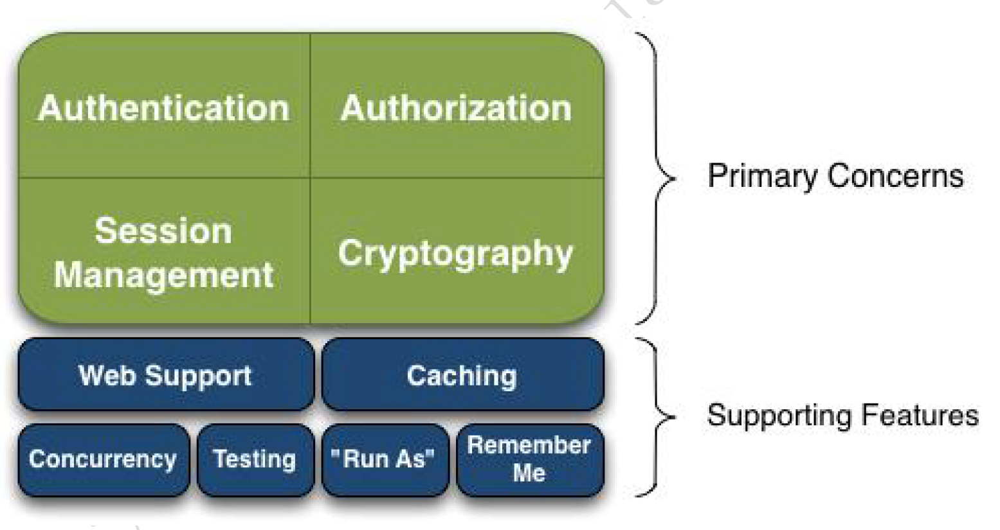
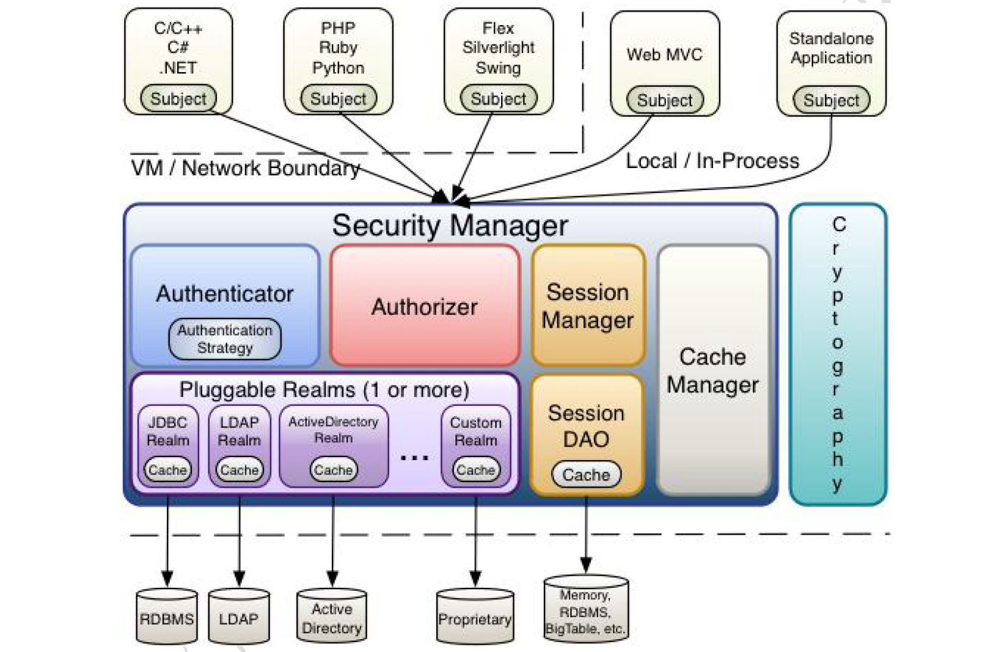

#什么是 Apache Shiro？
Apache Shiro是一个强大易用的 Java 安全框架，提供了认证、授权、加密和
会话管理功能，可为任何应用提供安全保障 - 从命令行应用、移动应用到大
型网络及企业应用。 
 
Shiro 为解决下列问题（应用安全的四要素）提供了保护应用的 API：
* 认证 - 用户身份识别，常被称为用户“登录”；
* 授权 - 访问控制；
* 密码加密 - 保护或隐藏数据防止被偷窥；
* 会话管理 - 每用户相关的时间敏感的状态。

其基本功能点如下图所示：  

  

#Shiro架构图  
  

#身份验证
一般流程：收集用户身份/凭证，调用Subject.login()进行登录，注意捕获
相应认证异常。  
````
Subject subject = SecurityUtils.getSubject();
UsernamePasswordToken token = new UsernamePasswordToken(username, password);
try {
    subject.login(token);
} catch (UnknownAccountException | IncorrectCredentialsException e) {
    error = "用户名/密码错误";
} catch (AuthenticationException e) {
    //其他错误，比如锁定，如果想单独处理请单独catch处理
    error = "其他错误：" + e.getMessage();
}
````  
Subject.login()会委托给SecurityManager；  
````
Subject subject = securityManager.login(this, token);
````  
SecurityManager会委托给Authenticator进行身份验证；
````
public AuthenticationInfo authenticate(AuthenticationToken token) throws AuthenticationException {
        return this.authenticator.authenticate(token);
}
````  
Authenticator将token传入Realm,从Realm获取认证信息；
````
protected AuthenticationInfo doAuthenticate(AuthenticationToken authenticationToken) throws AuthenticationException {
        assertRealmsConfigured();
        Collection<Realm> realms = getRealms();
        if (realms.size() == 1) {
            return doSingleRealmAuthentication(realms.iterator().next(), authenticationToken);
        } else {
            return doMultiRealmAuthentication(realms, authenticationToken);
        }
}
````
Realm：域，Shiro从这里获得安全数据（如用户角色权限）；自定义Realm中
身份认证：  
````
protected AuthenticationInfo doGetAuthenticationInfo(AuthenticationToken token) throws AuthenticationException {
        //获取表单提交的用户名，这是唯一的
        String username = (String)token.getPrincipal();  //得到用户名 (邮箱、电话、账号)
        //根据表单提供的用户名获取user
        User user=userServices.getUserByUsername(username);
        //根据用户名找不到数据抛出未知用户异常
        if(user==null){
            throw new UnknownAccountException();
        }
        //获取加密的密码、盐
        String password=user.getPassword();
        String salt=user.getSalt();
        
        SimpleAuthenticationInfo ai =
                new SimpleAuthenticationInfo(username, password, getName());
        ai.setCredentialsSalt(ByteSource.Util.bytes(salt));
        
        return ai;
}
````
如果有多个Realm，Authenticator会根据不同的AuthenticationStrategy产生
不同的验证结果；
````
protected AuthenticationInfo doMultiRealmAuthentication(Collection<Realm> realms, AuthenticationToken token) {

        AuthenticationStrategy strategy = getAuthenticationStrategy();

        AuthenticationInfo aggregate = strategy.beforeAllAttempts(realms, token);

        if (log.isTraceEnabled()) {
            log.trace("Iterating through {} realms for PAM authentication", realms.size());
        }

        for (Realm realm : realms) {

            aggregate = strategy.beforeAttempt(realm, token, aggregate);

            if (realm.supports(token)) {

                log.trace("Attempting to authenticate token [{}] using realm [{}]", token, realm);

                AuthenticationInfo info = null;
                Throwable t = null;
                try {
                    info = realm.getAuthenticationInfo(token);
                } catch (Throwable throwable) {
                    t = throwable;
                    if (log.isDebugEnabled()) {
                        String msg = "Realm [" + realm + "] threw an exception during a multi-realm authentication attempt:";
                        log.debug(msg, t);
                    }
                }

                aggregate = strategy.afterAttempt(realm, token, info, aggregate, t);

            } else {
                log.debug("Realm [{}] does not support token {}.  Skipping realm.", realm, token);
            }
        }

        aggregate = strategy.afterAllAttempts(token, aggregate);

        return aggregate;
    }
````  
默认AtLeastOneSuccessfulStrategy认证过程；
````
public AuthenticationInfo beforeAllAttempts(Collection<? extends Realm> realms, AuthenticationToken token) throws AuthenticationException {
        return new SimpleAuthenticationInfo();
}
public AuthenticationInfo beforeAttempt(Realm realm, AuthenticationToken token, AuthenticationInfo aggregate) throws AuthenticationException {
        return aggregate;
}
public AuthenticationInfo afterAttempt(Realm realm, AuthenticationToken token, AuthenticationInfo singleRealmInfo, AuthenticationInfo aggregateInfo, Throwable t) throws AuthenticationException {
        AuthenticationInfo info;
        if (singleRealmInfo == null) {
            info = aggregateInfo;
        } else {
            if (aggregateInfo == null) {
                info = singleRealmInfo;
            } else {
                info = merge(singleRealmInfo, aggregateInfo);
            }
        }

        return info;
}
public AuthenticationInfo afterAllAttempts(AuthenticationToken token, AuthenticationInfo aggregate) throws AuthenticationException {
        //we know if one or more were able to successfully authenticate if the aggregated account object does not
        //contain null or empty data:
        if (aggregate == null || isEmpty(aggregate.getPrincipals())) {
            throw new AuthenticationException("Authentication token of type [" + token.getClass() + "] " +
                    "could not be authenticated by any configured realms.  Please ensure that at least one realm can " +
                    "authenticate these tokens.");
        }

        return aggregate;
} 
````
#授权  
PermissionsAuthorizationFilter调用Subject的isPermitted();
````
if (perms != null && perms.length > 0) {
    if (perms.length == 1) {
        if (!subject.isPermitted(perms[0])) {
            isPermitted = false;
        }
    } else {
        if (!subject.isPermittedAll(perms)) {
            isPermitted = false;
        }
    }
}
````
Subject会委托给SecurityManager,SecurityManager会委托给Authorizer；
````
public boolean isPermittedAll(String... permissions) {
    return hasPrincipals() && securityManager.isPermittedAll(getPrincipals(), permissions);
}

public boolean[] isPermitted(PrincipalCollection principals, List<Permission> permissions) {
    return this.authorizer.isPermitted(principals, permissions);
}
````
默认ModularRealmAuthorizer会调用相应Realm的isPermitted();
````
public boolean isPermitted(PrincipalCollection principals, String permission) {
    assertRealmsConfigured();
    for (Realm realm : getRealms()) {
        if (!(realm instanceof Authorizer)) continue;
        if (((Authorizer) realm).isPermitted(principals, permission)) {
            return true;
        }
    }
    return false;
}
````  
默认为AuthorizingRealm的isPermitted()；
````
public boolean isPermitted(PrincipalCollection principals, String permission) {
    Permission p = getPermissionResolver().resolvePermission(permission);
    return isPermitted(principals, p);
}

public boolean isPermitted(PrincipalCollection principals, Permission permission) {
    AuthorizationInfo info = getAuthorizationInfo(principals);
    return isPermitted(permission, info);
}

protected boolean isPermitted(Permission permission, AuthorizationInfo info) {
    Collection<Permission> perms = getPermissions(info);
    if (perms != null && !perms.isEmpty()) {
        for (Permission perm : perms) {
            if (perm.implies(permission)) {
                return true;
            }
        }
    }
    return false;
}
````  
默认WildcardPermissionResolver会将字符串解析为Permission；  
getAuthorizationInfo()会调用自定义的Realm的doGetAuthorizationInfo()获取
AuthorizationInfo；  
将从AuthorizationInfo中获得的Permission与需要的进行比对完成鉴权；  
自定义的Realm的doGetAuthorizationInfo()；
````
protected AuthorizationInfo doGetAuthorizationInfo(PrincipalCollection principals) {
    SimpleAuthorizationInfo authorizationInfo = new SimpleAuthorizationInfo();
    //从数据库获取所有角色、根据角色添加权限信息
    List<Integer> perminssions=userServices.getPermisssionByUsername(principals.getPrimaryPrincipal().toString());
    for(Integer i:perminssions){
        authorizationInfo.addStringPermission(i.toString());
    }
    return authorizationInfo;
}
````

#拦截器  
程序入口为OncePerRequestFilter的doFilter()，调用AbstractShiroFilter
的doFilterInternal();
````
doFilterInternal(request, response, filterChain);
````  
接着调用executeChain();
````
protected void executeChain(ServletRequest request, ServletResponse response, FilterChain origChain)
            throws IOException, ServletException {
        FilterChain chain = getExecutionChain(request, response, origChain);
        chain.doFilter(request, response);
}
````  
getExecutionChain()会获取FilterChainResolver实例，调用该实例的
getChain()获取需要执行的过滤器链;  
````
FilterChainResolver resolver = getFilterChainResolver();
FilterChain resolved = resolver.getChain(request, response, origChain);
````  
Shiro中FilterChainResolver的实现是PathMatchingFilterChainResolver，
它通过FilterChainManager(默认DefaultFilterChainManager)管理过滤器连
,根据PatternMatcher的匹配规则获取请求对应过滤器链；  
````
for (String pathPattern : filterChainManager.getChainNames()) {
        // If the path does match, then pass on to the subclass implementation for specific checks:
        if (pathMatches(pathPattern, requestURI)) {
            if (log.isTraceEnabled()) {
                log.trace("Matched path pattern [" + pathPattern + "] for requestURI [" + requestURI + "].  " +
                        "Utilizing corresponding filter chain...");
            }
            return filterChainManager.proxy(originalChain, pathPattern);
        }
}
````  
可以通过FilterChainManager进行动态增加url模式与过滤器关系；
````
/*
 * 当添加一个url-过滤器关系的时候，更新每个url会获得的过滤器连(添加、更新一个权限的时候)
 */
public void initFilterChains(List<UrlFilter> urlFilters) {
    //1、首先删除以前老的filter chain并注册默认的
    filterChainManager.getFilterChains().clear();
    if(defaultFilterChains != null) {
        filterChainManager.getFilterChains().putAll(defaultFilterChains);
    }
    //2、循环URL Filter 注册filter chain
    for (UrlFilter urlFilter : urlFilters) {
        String url = urlFilter.getUrl();
        //注册roles filter
        if (!StringUtils.isEmpty(urlFilter.getRoles())) {
            filterChainManager.addToChain(url, "roles", urlFilter.getRoles());
        }
        //注册perms filter
        if (!StringUtils.isEmpty(urlFilter.getPermissions())) {
            filterChainManager.addToChain(url, "perms", urlFilter.getPermissions());
        }
    }
}
````  
获取过滤器链后，默认调用ProxiedFilterChain的doFilter();
````
public void doFilter(ServletRequest request, ServletResponse response) throws IOException, ServletException {
    if (this.filters == null || this.filters.size() == this.index) {
        //we've reached the end of the wrapped chain, so invoke the original one:
        if (log.isTraceEnabled()) {
            log.trace("Invoking original filter chain.");
        }
        this.orig.doFilter(request, response);
    } else {
        if (log.isTraceEnabled()) {
            log.trace("Invoking wrapped filter at index [" + this.index + "]");
        }
        this.filters.get(this.index++).doFilter(request, response, this);
    }
}
````  

#加密
AuthenticatingRealm会进行密码验证；
````
assertCredentialsMatch(token, info);
````
上述方法会获取CredentialsMatcher对象进行密码验证；
````
CredentialsMatcher cm = getCredentialsMatcher();
cm.doCredentialsMatch(token, info)
````
自定义CredentialsMatcher;
````
@Bean
public HashedCredentialsMatcher hashedCredentialsMatcher() {
    HashedCredentialsMatcher hashedCredentialsMatcher = new HashedCredentialsMatcher();
    hashedCredentialsMatcher.setHashAlgorithmName("md5");//散列算法:这里使用MD5算法;
    hashedCredentialsMatcher.setHashIterations(2);//散列的次数，比如散列两次，相当于 md5(md5(""));
    return hashedCredentialsMatcher;
}
````  
密码存储时应当与此处加密算法一样；用户提交的密码经加密算法后与存储的密码
进行比较；
````
@Override
public boolean doCredentialsMatch(AuthenticationToken token, AuthenticationInfo info) {
    Object tokenHashedCredentials = hashProvidedCredentials(token, info);
    Object accountCredentials = getCredentials(info);
    return equals(tokenHashedCredentials, accountCredentials);
}

protected Object hashProvidedCredentials(AuthenticationToken token, AuthenticationInfo info) {
    Object salt = null;
    if (info instanceof SaltedAuthenticationInfo) {
        salt = ((SaltedAuthenticationInfo) info).getCredentialsSalt();
    } else {
        //retain 1.0 backwards compatibility:
        if (isHashSalted()) {
            salt = getSalt(token);
        }
    }
    return hashProvidedCredentials(token.getCredentials(), salt, getHashIterations());
}

protected Hash hashProvidedCredentials(Object credentials, Object salt, int hashIterations) {
    String hashAlgorithmName = assertHashAlgorithmName();
    return new SimpleHash(hashAlgorithmName, credentials, salt, hashIterations);
}
````