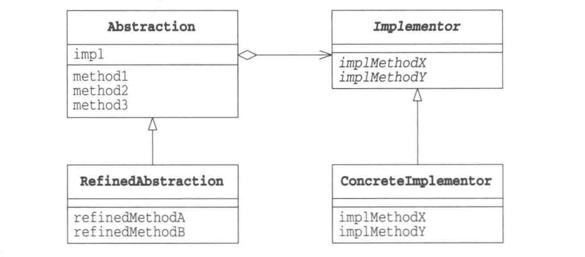
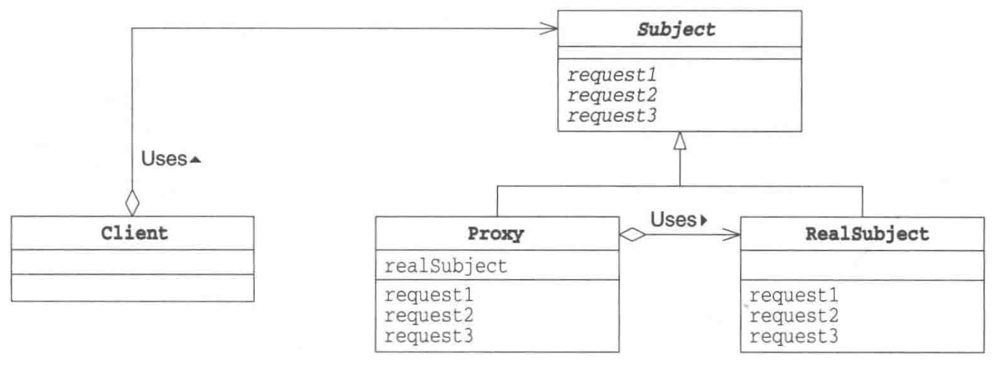
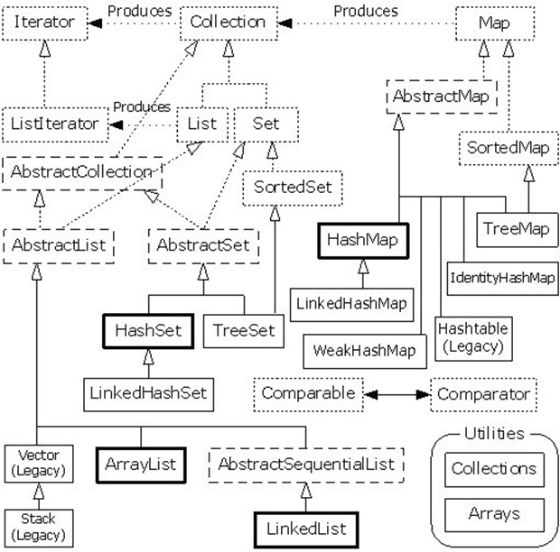
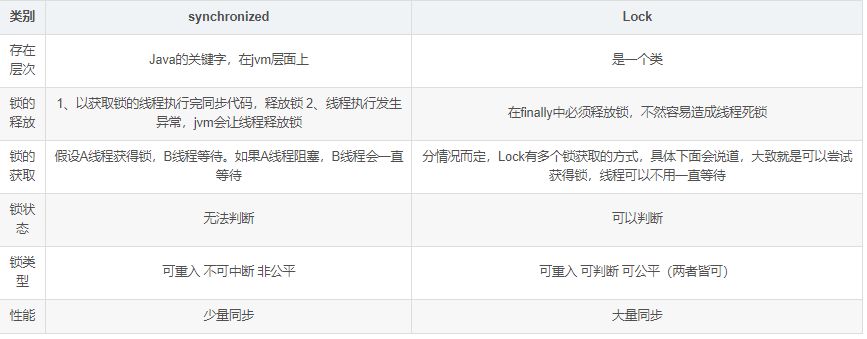

# 在java中==和equals()的区别  
==是直接比较的两个对象的堆内存地址，如果相等，则说明这两个引用实际是指向同一个对象地址的。对于基本数据类型
（byte，short，char，int，float，double，long，boolean）来说，他们是作为常量在方法区中的常量池里面以HashSet
策略存储起来的，对于这样的字符串 "123" 也是相同的道理，在常量池中，一个常量只会对应一个地址，因此不管是再多
的 123,"123" 这样的数据都只会存储一个地址，所以所有他们的引用都是指向的同一块地址，因此基本数据类型和String
常量是可以直接通过==来直接比较的。  
另外，对于基本数据的包装类型（Byte, Short, Character，Integer，Float, Double，Long,  Boolean）除了Float和
Double之外，其他的六种都是实现了常量池的，因此对于这些数据类型而言，一般我们也可以直接通过==来判断是否相等。
Integer 在常量池中的存储范围为[-128,127]。
  
在Object类型的equals方法是直接通过==来比较的，和==是没有任何区别的。但equals方法是可以由我们自己重写的。  
  
# String类  
采用了共享模式；  
String类被final关键字修饰，不能被继承；  
String pools是为了提高JAVA内存利用率而采用的措施，当遇到String a = “HELLO”时，JAVA会先在字符串池中查找是否存
在“HELLO”这个字符串，如果没有，则新创建一个对象，然后变量a指向这个地址，然后再遇到String b = “HELLO”时，由于
字符串池中以及有了“HELLO”这个对象，所以直接将变量b的地址指向“HELLO”，省去了重新分配的麻烦；
使用new操作创建的字符串对象不指向字符串池中的对象，会先为变量开辟空间，然后将值写入空间。
intern()方法的原理：如果池中已经有相同的 字符串。有则直接返回池中的字符串，否则先将字符串添加到池中，再返回。
````
public static void main(String[] args) {
	String a = "HELLO";
	String b = "HELLO";
	String c = new String("HELLO");
	String d = new String("HELLO");
	System.out.println(a == b); //true 这里true，字符池的效果体现出来了
	System.out.println(b == c); //false
	System.out.println(c == d); //false
	System.out.println(a.equals(b)); //true equals都会返回true

	//intern()方法试用一把
	c = c.intern();
	System.out.println(b == c); //true 这里直接也返回true了
}
````

# String类不可变性的好处
1.只有当字符串是不可变的，字符串池才有可能实现。字符串池的实现可以在运行时节约很多heap空间，因为不同的字符串
变量都指向池中的同一个字符串。但如果字符串是可变的，那么String interning将不能实现(译者注：String interning是
指对不同的字符串仅仅只保存一个，即不会保存多个相同的字符串。)，因为这样的话，如果变量改变了它的值，那么其它指
向这个值的变量的值也会一起改变。  
2.如果字符串是可变的，那么会引起很严重的安全问题。譬如，数据库的用户名、密码都是以字符串的形式传入来获得数据库
的连接，或者在socket编程中，主机名和端口都是以字符串的形式传入。因为字符串是不可变的，所以它的值是不可改变的，
否则黑客们可以钻到空子，改变字符串指向的对象的值，造成安全漏洞。  
3.因为字符串是不可变的，所以是多线程安全的，同一个字符串实例可以被多个线程共享。这样便不用因为线程安全问题而使
用同步。字符串自己便是线程安全的。  
4.类加载器要用到字符串，不可变性提供了安全性，以便正确的类被加载。譬如你想加载java.sql.Connection类，而这个值被
改成了myhacked.Connection，那么会对你的数据库造成不可知的破坏。  
5.因为字符串是不可变的，所以在它创建的时候hashcode就被缓存了，不需要重新计算。这就使得字符串很适合作为Map中的
键，字符串的处理速度要快过其它的键对象。这就是HashMap中的键往往都使用字符串。

# String, StringBuffer, StringBuilder区别  
String是字符串常量，而StringBuffer和StringBuilder是字符串变量。由String创建的字符内容是不可改变的，而由
StringBuffer和StringBuidler创建的字符内容是可以改变的。  
String类中定义的char数组是final的；而StringBuffer和StringBuilder都是继承自AbstractStringBuilder类，它们的内部
实现都是靠这个父类完成的，而这个父类中定义的char数组只是一个普通是私有变量，可以用append追加。  
StringBuffer是线程安全的，而StringBuilder是非线程安全的。StringBuilder是从JDK 5开始，为StringBuffer类补
充的一个单线程的等价类。我们在使用时应优先考虑使用StringBuilder，因为它支持StringBuffer的所有操作，但是
因为它不执行同步，不会有线程安全带来额外的系统消耗，所以速度更快。

# 基本类型中的缓冲池? 什么时候使用缓冲池的数据?
Java虚拟机为了优化8中基本数据类型的包装对象，为他们提供了缓冲池，缓冲池的大小为一个字节。（8个bit位，长度为2^8
位，范围是-128~127）。超过缓冲池的范围，包装类对象就自己在缓冲池外面赋值。如果对象的值在缓冲池范围内，就指向缓
冲池的值，缓冲池里面的值是共享的。

# java中的null类型
java语言中有两种类型，一种是基本类型，还有一种是引用类型。  
1. 首先，null是java中的关键字，像public、static、final。它是大小写敏感的，你不能将null写成Null或NULL，编译器
将不能识别他们然后报错。
2. 就像每种原始类型都有默认值一样，int默认值为0，boolean的默认值为false，null是任何引用类型的默认值，不严格的说
是所有object类型的默认值。就像你创建了一个布尔类型的变量，它将false作为自己的默认值，java中的任何引用变量都将null
作为默认值。这对所有变量都是适用的，如成员变量、局部变量、实例变量、静态变量(但当你使用一个没有初始化的局部变量，
编译器会警告你)。
3. 要澄清一些误解，null既不是对象也不是一种类型，它仅是一种特殊的值，你可以将其赋予任何引用类型，你也可以将null转
化成任何类型。
4. null可以赋值给引用变量，不能将null赋值给基本类型变量，如int、double、float、boolean。
5. 任何含有null值的包装类在java拆箱生成基本数据类型时候都会抛出一个空指针异常。
6. 如果使用了带有null值的引用类型的变量，instanceof操作会返回false  
7. 可以使用静态方法来使用一个值为null的引用类型变量。因为静态方法使用静态类型绑定，不会抛空指针异常
9 可以将null传递给方法使用，这时方法可以接收任何引用类型，如 public void print(Object obj) 可以这样调用print(null).
编译可以通过，但结果就取决去你的方法了。这个例子中的print方法，不会抛出空指针异常，只是退出，业务逻辑允许的话，
推荐使用null安全的方法。
10. 可以使用== 或者 != 操作来比较null值，但是不能使用其他算法或者逻辑操作，如大于、小于。与SQL不同，java中的null==null
会返回true；

# switch…case语句
case 标签可以是 ：
* 类型为 char、byte、short 或 int 的常量表达式。
* 枚举常量。
* 从 Java SE 7 开始，case 标签还可以是字符串字面量。

# Object有哪些方法
1. clone方法
保护方法，实现对象的浅复制，只有实现了Cloneable接口才可以调用该方法，否则抛出CloneNotSupportedException异常。
2. getClass方法
final方法，获得运行时类型。
3. toString方法
该方法用得比较多，一般子类都有覆盖。返回一个能代表该类型的字符串。
4. finalize方法
该方法用于释放资源。因为无法确定该方法什么时候被调用，很少使用。
5. equals方法
该方法是非常重要的一个方法。一般equals和==是不一样的，但是在Object中两者是一样的。子类一般都要重写这个方法。
6. hashCode方法
该方法用于哈希查找，重写了equals方法一般都要重写hashCode方法。这个方法在一些具有哈希功能的Collection中用到。
一般必须满足obj1.equals(obj2)==true。可以推出obj1.hashCode()==obj2.hashCode()，但是hashCode相等不一定就满足equals。
不过为了提高效率，应该尽量使上面两个条件接近等价。
7. wait方法
wait方法就是使当前线程等待该对象的锁，当前线程必须是该对象的拥有者，也就是具有该对象的锁。wait()方法一直等待，直到获
得锁或者被中断。wait(long timeout)设定一个超时间隔，如果在规定时间内没有获得锁就返回。
调用该方法后当前线程进入睡眠状态，直到以下事件发生。
（1）其他线程调用了该对象的notify方法。
（2）其他线程调用了该对象的notifyAll方法。
（3）其他线程调用了interrupt中断该线程。
（4）时间间隔到了。
此时该线程就可以被调度了，如果是被中断的话就抛出一个InterruptedException异常。
8. notify方法
该方法唤醒在该对象上等待的某个线程。
9. notifyAll方法
该方法唤醒在该对象上等待的所有线程。

# lambda表达式

# 抽象，封装，继承，多态
* 抽象:将相同的类的共同特征总结出来，构造成类的过程。包括数据抽象以及行为抽象。数据抽象变成类的成员变量，行为抽象变成类
的成员函数。抽象只关心成员变量以及成员函数，并不关系具体的实现细节。  
* 继承是从已有的类得到继承信息创建新的类的过程，继承可以表示为 is-a 关系 。比如动物就是父类或者说基类。那么动物有很多种，
比如小狗，小猫，它们有很多共同的属性，它们都是动物。那么表现在代码里就是，它们可以直接把行为或者数据继承过来。  
* 封装其实可以理解为：“装”与“封”，就是把数据以及操作方法封装在函数里/类，然后再装起来。也就是把数据以及操作数据的方法绑定
起来，对外界提供已经定义好的接口进行访问。面向对象的本质就是将现实世界描绘成一系列的完全自治，封闭的对象。可以理解为我们
无论内部实现有多复杂，使用者可以完全不用理，只需要知道怎么使用就可以了。
* 多态可以大概分为两种方式：方法重载与方法重写。  
方法重载（Overload）:编译时的多态性（也就是前绑定），方法可以根据不同参数类型进行不同的调用，方法名字一致。  
方法重写（Override）:运行时的多态（也称为后绑定）。要实现方法重写需要做：1.方法重写，也就是子类继承父类并重写了父类已经
有的方法。 2.用父类型引用来引用子类型对象，这样可以实现调用同样的方法会根据子类对象的不同表示出不一样的行为。

# a += b 与 a = a + b有什么区别
先运算后赋值可能会有类型转换问题；

# 怎样将byte数组转换为string
1. 通过String类将String转换成byte[]或者byte[]转换成String；
2. 通过Base64 将String转换成byte[]或者byte[]转换成String[Java 8]

# 一些代码
````
byte a1 = 1, a2 = 2;
final byte b1 = 2, b2 = 3;
a1 = b1 + b2;  	// 不会报错
a1 = a1 + a2;	// 会报错

````  
````
String s1 = "abc";
String s2 = new String(s1);
s1 == s2;		// false
s1.equals(s2);	// true
````  
````
String s1 = "abc";
String s2 = "a" + new String("bc");
String s3 = "a" + "bc";
s1 == s2;	// false
s1 == s3;  // true
````  

# 基本数据类型转换 
byte、short、char运算会转换为Int；  
如操作数之一为double，则另一个操作数先被转化为double，再参与算术运算。   
类型提升就是指在多种不同数据类型的表达式中，类型会自动向范围表示大的值的数据类型提升。  
如采用+=、*=等缩略形式的运算符，系统会自动强制将运算结果转换为目标变量的类型。  
当运算符为自动递增运算符（++）或自动递减运算符（--）时，如果操作数为byte，short或char类型不发生改变；  

# 引用类型间转换
子类能直接转换为父类 或 接口类型；  
父类转换为子类要 强制类型转换；且在运行时若实际不是对应的对象，会抛出ClassCastException运行时异常；  

# java标识符
由英文字母或数字组成的；英文字母是大写的A-Z，小写的是a-z，以及“_”和“$”；数字包括0-9；其他的符号是不
能用在标识符里的。不能用Java所保留的关键字。在Java里标识符是大小写敏感的。  

# 字节流和字符流又有什么区别
1. 字节流可用于任何类型的对象，包括二进制对象，而字符流只能处理字符或者字符串，字节流提供了处理任何类型
的IO操作的功能，但它不能直接处理Unicode字符，而字符流就可以；
2. 字符流处理的单元为2个字节的Unicode字符，分别操作字符、字符数组或字符串，而字节流处理单元为1个字节，操
作字节和字节数组。
3. 字节流也称为原始数据，需要用户读入后进行相应的编码转换。而字符流的实现是基于自动转换的，读取数据时
会把数据按照JVM的默认编码自动转换成字符。  
字符流主要为了国际化，支持UNICODE；

# 读写文件实例
````
//递归输出给定字符串下文件目录
public void printFile(String dirStr) {
	printFile(null,dirStr,"");
}
public void printFile(File parent,String dirStr,String strPre) {
	File f1=new File(parent,dirStr);
	if(!f1.isDirectory()) {
		System.out.println("文件："+strPre+f1.getName());
		return ;
	}
	System.out.println("目录："+strPre+f1.getName());
	strPre=strPre+"++";
	for(String fileStr:f1.list()) {
		printFile(f1,fileStr,strPre);
	}
}
````  
````
/*
 * 读取指定文件
 */
public void readFile(String filePath) {
	File file=new File(filePath);
	try {
		FileInputStream in=new FileInputStream(file);
		BufferedReader reader=
				new BufferedReader(new InputStreamReader(in, "utf-8"));
		String s;
		while ((s=reader.readLine())!=null) {
			System.out.println(s);
		}
		reader.close();
	} catch (FileNotFoundException e) {
		e.printStackTrace();
	} catch (IOException e) {
		e.printStackTrace();
	}
}
````  
````
/*
 * 向指定文件写内容
 */
public void writeFile(String filePath) {
	File file=new File(filePath);
	try {
		FileOutputStream out=new FileOutputStream(file);
		BufferedWriter writer=
				new BufferedWriter(new OutputStreamWriter(out, "utf-8"));
		for(int i=0;i<5000;i++) {
			writer.write(i+"   :"+"some 新东西");
			writer.newLine();
		}
		writer.flush();
		writer.close();
	} catch (FileNotFoundException e) {
		e.printStackTrace();
	} catch (IOException e) {
		e.printStackTrace();
	}
}
````  
````
/*
 * 利用nio读文件
 */
public void nioRead(String filePath) {
	File file=new File(filePath);
	ByteBuffer buffer=ByteBuffer.allocate(1024);
	try {
		FileChannel in=new FileInputStream(file).getChannel();
		int i;
		while((i=in.read(buffer))!=-1) {
			buffer.flip();
			System.out.print(Charset.forName("utf-8").decode(buffer));
			buffer.clear();
		}
		in.close();
	} catch (FileNotFoundException e) {
		e.printStackTrace();
	} catch (IOException e) {
		e.printStackTrace();
	}
}
````  
````
/*
 * 利用nio写文件
 */
public void nioWrite(String filePath) {
	File file=new File(filePath);
	ByteBuffer buffer=ByteBuffer.allocate(1024);
	try {
		FileChannel out=new FileOutputStream(file).getChannel();
		for(int i=0;i<5000;i++) {
			buffer.put("测c123s试\r\n".getBytes("utf-8"));
			buffer.flip();
			out.write(buffer, out.size());
			buffer.clear();
		}
		out.close();
	} catch (FileNotFoundException e) {
		e.printStackTrace();
	} catch (IOException e) {
		e.printStackTrace();
	}
} 
````  

# 先继承后实现

# 类之间的关系
* 依赖（ dependence ), 即“ uses-a” 关系， 是一种最明显的、 最常见的关系。例如， Order类使用
 Account 类是因为 Order 对象需要访问 Account 对象查看信用状态。但是 Item 类不依赖于 Account 
 类， 这是因为 Item 对象与客户账户无关。因此， 如果一个类的方法操纵另一个类的对象，我们就说
 一个类依赖于另一个类。应该尽可能地将相互依赖的类减至最少。
* 聚合（aggregation ), 即“ has-a” 关系， 是一种具体且易于理解的关系。 例如， 一个Order 对象
 包含一些 Item 对象。聚合关系意味着类 A 的对象包含类 B 的对象。
* 继承（ inheritance ), 即“ is-a” 关系， 是一种用于表示特殊与一般关系的。

# JRE判断程序是否执行结束的标准是什么
所有用户线程执行完毕；不包括守护线程；

# JDBC使用什么设计模式?
jdbc规范使用到主要涉及的设计模式：桥接模式；  
桥接模式的作用：在“类的功能层次结构”与“类的实现层次结构”之间建立桥梁；  
类的功能层次结构：1，父类中具有基本功能；2，在子类中增加新的功能；    
类的实现层次结构：1，父类通过声明抽象方法来定义接口；2，子类通过实现具体方法来实现接口；  
  
上图中类的功能层次结构：Abstraction，RefinedAbstraction;类的实现层次结构:
Implementor,ConcreteImplementor;桥梁为Abstraction持有的impl；  

# 解释一下驱动在JDBC中的角色
DriverManager就是其中的Abstraction，java.sql.Driver
是 Implementor，com.mysql.jdbc.Driver是Implementor的一个具体实现；

# JDBC执行大致流程
1， 加载JDBC驱动程序；
````
Class.forName("com.mysql.jdbc.Driver") ;
````  
2， 提供JDBC连接的URL，用户名，密码
````
String url = "jdbc:mysql://localhost:3306/test" ; 
````  
3， 创建数据库的连接
````
try{ 
Connection con = DriverManager.getConnection(url , username , password ) ; 
}catch(SQLException se){ 
System.out.println("数据库连接失败！"); 
se.printStackTrace() ; 
}
````  
4， 创建一个Statement
Statement实例分为以下 3 种类型：  
1、执行静态SQL语句。通常通过Statement实例实现。  
2、执行动态SQL语句。通常通过PreparedStatement实例实现。  
3、执行数据库存储过程。通常通过CallableStatement实例实现。
````
Statement stmt = con.createStatement() ; 
PreparedStatement pstmt = con.prepareStatement(sql) ; 
CallableStatement cstmt = con.prepareCall("{CALL demoSp(? , ?)}") ;
````  
5， 执行SQL语句  
Statement接口提供了三种执行SQL语句的方法：executeQuery 
、executeUpdate 和 execute  
1、ResultSet executeQuery(String sqlString)：执行查询数据库的SQL
语句 ，返回一个结果集（ResultSet）对象。  
2、int executeUpdate(String sqlString)：用于执行INSERT、UPDATE
或 DELETE语句以及SQL DDL语句，如：CREATE TABLE和DROP TABLE等  
3、execute(sqlString):用于执行返回多个结果集、多个更新计数或二者
组合的语句。  
````  
ResultSet rs = stmt.executeQuery("SELECT * FROM ...") ; 
int rows = stmt.executeUpdate("INSERT INTO ...") ; 
boolean flag = stmt.execute(String sql) ;
````  
6， 处理结果  
两种情况：  
1、执行更新返回的是本次操作影响到的记录数。  
2、执行查询返回的结果是一个ResultSet对象。  
````
while(rs.next()){ 
　　String name = rs.getString("name") ; 
　　String pass = rs.getString(1) ; // 此方法比较高效 
}
````  
7， 关闭JDBC对象  
操作完成以后要把所有使用的JDBC对象全都关闭，以释放JDBC资源，关闭顺序
和声明顺序相反：  
1、关闭记录集  
2、关闭声明  
3、关闭连接对象  
````
if(rs != null){ // 关闭记录集 
　　try{ 
        rs.close() ; 
　　}catch(SQLException e){ 
　　　　e.printStackTrace() ; 
　　} 
} 
if(stmt != null){ // 关闭声明 
　　try{ 
　　　　stmt.close() ; 
　　}catch(SQLException e){ 
　　　　e.printStackTrace() ; 
　　} 
} 
if(conn != null){ // 关闭连接对象 
　　try{ 
　　　　conn.close() ; 
　　}catch(SQLException e){ 
　　　　e.printStackTrace() ; 
　　} 
}
````  

# 一般关系型和对象数据模型之间的对应关系
* 每个持久对象映射一张表;每个持久对象必须有一个主键;
* 持久对象之间的关系用外键关联
* 持久对象要有内聚性，无关的内容拿出去，单独创建持久对象

# JDK, JRE, JVM的区别和联系
JVM ：英文名称（Java Virtual Machine），就是我们耳熟能详的 Java 虚拟
机。它只认识 xxx.class 这种类型的文件，它能够将 class 文件中的字节码
指令进行识别并调用操作系统向上的 API 完成动作。  
JRE ：英文名称（Java Runtime Environment），我们叫它：Java 运行时环
境。它主要包含两个部分，jvm 的标准实现和 Java 的一些基本类库。它相
对于 jvm 来说，多出来的是一部分的 Java 类库。  
JDK ：英文名称（Java Development Kit），Java 开发工具包。jdk 是
整个 Java 开发的核心，它集成了 jre 和一些好用的小工具。例
如：javac.exe，java.exe，jar.exe 等。  

# Java中Arrays.sort()如何实现排序
小于286进入五轴快排；  
大于286进行检查数组结构， 无结构进行归并排序；否则快排；   
双轴快排算法步骤:
1. 对于很小的数组（长度小于47），会使用插入排序。  
2. 选择两个点P1,P2作为轴心，比如我们可以使用第一个元素和最后一个元素。
3. P1必须比P2要小，否则将这两个元素交换，现在将整个数组分为四部分：
   （1）第一部分：比P1小的元素。
   （2）第二部分：比P1大但是比P2小的元素。
   （3）第三部分：比P2大的元素。
   （4）第四部分：尚未比较的部分。
   在开始比较前，除了轴点，其余元素几乎都在第四部分，直到比较完之后
   第四部分没有元素。
4. 从第四部分选出一个元素a[K]，与两个轴心比较，然后放到第一二三部分
中的一个。
5. 移动L，K，G指向。
6. 重复 4 5 步，直到第四部分没有元素。
7. 将P1与第一部分的最后一个元素交换。将P2与第三部分的第一个元素交换。
8. 递归的将第一二三部分排序。  

# JDK消费者生产者模型应用

# final修饰符
final可以修饰类，方法，变量（成员变量和局部变量）  
修饰类，终态类，类不能被继承。  
修饰方法，方法不能被重写。  
修饰变量，变量只能被赋值一次，不能被重新赋值，其实就是一个常量。对于
引用类型表示指向地址不变，但具体内容可变。

# 空接口作用
标志性作用；

# 浅克隆与深克隆
clone()这个方法是从Object继承下来的，一个对象要实现克隆，需要实现一
个叫做Cloneable的接口。  
Object中的克隆方法是浅度克隆，JDK规定了克隆需要满足的一些条件，简要
总结一下就是：对某个对象进行克隆，对象的的成员变量如果包括引用类型
或者数组，那么克隆的时候其实是不会把这些对象也带着复制到克隆出来的
对象里面的，只是复制一个引用，这个引用指向被克隆对象的成员对象，但
是基本数据类型是会跟着被带到克隆对象里面去的。而深度可能就是把对象
的所有属性都统统复制一份新的到目标对象里面去。
浅克隆：clone()；  
深克隆：重写clone()；利用序列化；  

# char、中文字符
Java的char内部编码为UTF-16；  
在UTF-16编码中，大于U+10000码位将被编码为一对16比特长的码元，即按4
个字节编码，此时char无法表示。  

# RTTI
运行时类型信息可以让你在程序运行时发现和使用类型信息。  
三种情况会触发Class Loader动态加载class对象到JVM：  
（1）第一次静态方法被调用；  
（2）第一次被new实例化；  
（3）包含静态代码块；  
取得Class对象(若还未加载则先加载)的引用有两种方式：  
（1）方法Class.forName("className")   
（2） .class 类字面常量。不会将类的初始化；  

# 什么是反射机制
JAVA反射机制是在运行状态中，对于任意一个类，都能够知道这个类的所有
属性和方法；对于任意一个对象，都能够调用它的任意一个方法和属性；这
种动态获取的信息以及动态调用对象的方法的功能称为java语言的反射机制。

# 反射机制优缺点
优点：可以实现动态创建对象和编译，体现出很大的灵活性；
缺点：反射操作的效率要比那些非反射操作低得多；安全限制 ；内部暴露，
破坏了封装性；

# 获取Class对象的三种方式
1. Object ——> getClass();  
2. 任何数据类型（包括基本数据类型）都有一个“静态”的class属性  
3. 通过Class类的静态方法：forName（String  className）(常用)  

# Java反射中Class.forName和classloader的区别
Class.forName除了将类的.class文件加载到jvm中之外，还会对类进行解
释，执行类中的static块。  
而classloader只干一件事情，就是将.class文件加载到jvm中，不会执
行static中的内容，只有在newInstance才会去执行static块。  

# 注解
常见的作用有以下几种：  
1.生成文档。这是最常见的，也是java 最早提供的注解。常用的
有@see @param @return 等；  
2.跟踪代码依赖性，实现替代配置文件功能。比较常见的是spring 2.5 开
始的基于注解配置。作用就是减少配置。现在的框架基本都使用了这种配
置来减少配置文件的数量；  
3.在编译时进行格式检查。如@Override放在方法前，如果你这个方法并不是
覆盖了超类方法，则编译时就能检查出；  

自定义注解类编写的规则：  
注解类型定义为 @interface，所有的注解会自动继
承 java.lang.Annotation 这一接口，而且不能再去继承其他的类或接口；  
参数成员只能用 public 或 default 两个关键字修饰；  
参数成员只能用基本类型：byte, short, char, int, long, 
float, double, boolean，以及 String, Enum, Class, Annotations 等数
据类型，以及这些类型的数组；  
要获取类方法和字段的注解信息，必须通过 Java 的反射技术；  
注解也可以不定义成员变量，但这样的注解没有什么卵用；  
自定义注解需要使用元注解进行编写；  
 
# 面向对象编程与面向过程编程的区别
面向过程是指在遇到问题的时候，怎么去解决这个问题，而分析问题的步骤，
就是解决这个问题的方法，是通过方法一步一步来完成的。面向对象是指在
遇到问题的时候，把问题分解成各自独立功能的类，而这个类是完成各自问
题的。总结如下所述。  
面向过程和面向对象最明显的区别就是，面向对象是按照要完成的功能来实
现的，而面向过程是按照解决这个问题的步骤来实现的。  
面向对象是按照程序中的功能进行划分的。  
面向过程是按照问题的解决思路来划分的，是一步一步来解决问题的。  
面向过程更看重的是完成问题的过程。  
面向对象更看重的是功能，通过各种功能模块的组合来完成问题。

# 内部类
1. 内部类可以直接访问外部类中的成员，包括私有。访问格式：外部类
名.this；外部类要访问内部类必须创建内部类对象。内部类在成员位置
上，可以被成员修饰符修饰。
2. 静态内部类；静态内部类 只能访问外部类的静态成员；
3. 局部内部类；内部类定义在局部时，可以直接访问外部类中的成员。访问
局部变量必须被final修饰。
4. 匿名内部类；匿名内部类是内部类的简写格式。匿名内部类的前提：内部
类必须继承一个类或者实现接口。匿名内部类不能创建构造函数。

#  为什么非静态内部类里面不能定义静态方法、静态成员变量、静态初始化块
静态属性不依赖于对象，所以访问修改的时候不需要依赖当前有没有存活的
对象。内部类其实也可以认为是外部类的一个成员变量，想要访问内部类，必
须先实例化外部类，然后通过外部类才能访问内部类。只要是成员变量，就需
要依赖具体的对象，这个时候如果在非静态内部类里面声明静态属性就会破
坏了这一逻辑，所以java语言在语义层面不允许我们那么做。

# 动态代理
## 代理模式

代理：本来应该自己做的事情，却请了别人来做，被请的人就是代理对象。  
动态代理：在程序运行过程中产生的这个对象  
## 动态代理代码示例
````
//写一个类实现InvocationHandler接口
public class MyInvocationHandler implements InvocationHandler {
    private Object target; // 目标对象；被代理对象
    
    public MyInvocationHandler(Object target) {
        this.target = target;    
    }

    //重写invoke()方法
    public Object invoke(Object proxy, Method method, Object[] args) 
    throws Throwable {        
        System.out.println("权限校验");
        Object result = method.invoke(target, args);
        System.out.println("日志记录");
        return result; // 返回的是代理对象
    }
}
````
````
MyInvocationHandler handler = new MyInvocationHandler(ud);
// 获取代理对象；newProxyInstance方法第一个参数是实际主体的类加载器；
// 第二个是da代理对象与实际主体的一致性接口；
UserDao proxy = (UserDao) Proxy.newProxyInstance(ud.getClass()
.getClassLoader(), ud.getClass().getInterfaces(), handler);
proxy.add();
proxy.delete();
proxy.update();
proxy.find();
````
## JDK动态代理和cglib动态代理有什么区别
JDK动态代理只能对实现了接口的类生成代理对象；  
cglib可以对任意类生成代理对象，它的原理是对目标对象进行继承代理，
如果目标对象被final修饰，那么该类无法被cglib代理。
## SpringAOP的本质就是动态代理
SpringAOP混合使用。如果被代理对象实现了接口，就优先使用JDK代理，如
果没有实现接口，就用用cglib代理。

# 如何获取父类的类名
getClass()方法在Object类中被定义为final与native，子类不能覆盖该方
法。因此，this.getClass()和super.getClass()最终都调用的是Object类
中的getClass()方法。而Object类的getClass()方法的的功能是“返回
本Object类的运行时的类”。    
通过的反射机制，使用getClass().getSuperclass().getName()。

# 泛型
## 什么是泛型？为什么要使用泛型？
泛型，即“参数化类型”。就是将类型由原来的具体的类型参数化，类似于
方法中的变量参数，此时类型也定义成参数形式（可以称之为类型形参），
然后在使用/调用时传入具体的类型（类型实参）。  
泛型的本质是为了参数化类型（在不创建新的类型的情况下，通过泛型指定
的不同类型来控制形参具体限制的类型）。增加类的可复用性。
## 什么是 Java 泛型中的限定通配符和非限定通配符？有什么区别？
限定通配符对类型进行限制，泛型中有两种限定通配符，一种
是 <? extends T> 来保证泛型类型必须是 T 的子类来设定泛型类型的上
边界，另一种是 <? super T> 来保证泛型类型必须是 T 的父类来设定类型
的下边界，泛型类型必须用限定内的类型来进行初始化，否则会导致编译
错误。非限定通配符 <?> 表示可以用任意泛型类型来替代，可以在某种意
义上来说是泛型向上转型的语法格式，因为 List<String> 与 List<Object>
 不存在继承关系。
## 简单说说 List\<Object> 与 List 原始类型之间的区别？  
主要区别有两点。  
原始类型和带泛型参数类型 \<Object> 之间的主要区别是在编译时编译器不
会对原始类型进行类型安全检查，却会对带参数的类型进行检查，通过
使用 Object 作为类型可以告知编译器该方法可以接受任何类型的对象（
比如 String 或 Integer）。  
我们可以把任何带参数的类型传递给原始类型 List，但却不能
把 List\<String> 传递给接受 List\<Object> 的方法，因为会产生编
译错误。
## List\<Object> 与 List\<?> 类型之间的区别
我们可以把 List\<String>、List\<Integer> 赋值给 List\<?>，却不能
把 List\<String> 赋值给 List\<Object>.
## Java 中不能创建泛型数组
由于泛型擦除，结果就是泛型的检查作用失效，可以将 List<Integer> 
类型的值添加到 List<String>[] 类型的数组中。而这类问题在编译时无法
发现，只能在运行时出现问题。
## 什么是泛型擦除
泛型擦除就是类型变量用第一个限定来替换,如果没有给定限定就用Object替
换。只在编译期进行，不影响程序性能。
# try-catch-finally执行过程? finally是不是一定会执行?
不管有没有捕获到异常，finally中的代码块均会被执行  
finally是在return之后执行的，程序在执行完return之后，会将值保存起
来，当执行完finally中的代码块之后，再将return的值进行返回  
如果finally中存在return时，会导致最终返回的结果，就是finally中的
值，而不会是try或者catch中的值  
如果在finally中存在return时，会导致程序提前退出  

finally不是一定会执行:  
主动调用System.exit(0);  
Daemon线程是一种支持性线程，称之为守护线程;

# 装箱与拆箱
装箱就是将基本数据类型转化为包装类型，那么拆箱就是将包装类型转化
为基本数据类型。
Integer的valueOf（int i）方法可以将一个基本数据类型转化为对应的包
装类型，即装箱方法。
而Integer的intValue（）方法则可以将一个包装类型转化为对应的基本数
据类型，即拆箱方法。
观察Integer类的源码中的valueOf（）：
````
public static Integer valueOf(int i) {
    if (i >= IntegerCache.low && i <= IntegerCache.high)
        return IntegerCache.cache[i + (-IntegerCache.low)];
    return new Integer(i);
}
````
当i的值位于[-128,127]的时候，会直接返回Integer缓存数组中相应对象的
引用，如果i大于127或小于-128，会重新创建一个Integer实例，并返回。  
Byte、Short、Integer、Long、Character的valueOf（）实现机制类似。  
但是Float、Double中的valueOf（），永远返回新创建的对象，因为一个范
围内的整数是有限的，但是小数却是无限的，无法保存在缓存中。
````
public class TestBox3 {
    public static void main(String[] args) {
        Integer a = 1;
        Integer b = 2;
        Integer c = 3;
        Long d = 2L;
        Long e = 3L;
        int f = 2;
 
        //一旦有包装类型和数值类型判断==时，则触发包装类型的自动拆箱，转为数值类型的比较
        System.out.println(new Integer(300) == 300);//返回true
 
        //一旦有包装类型和数值类型发生运算时，则触发包装类型的自动拆箱，转为数值类型的运算
        System.out.println(c == (a + f));//返回true
 
        //一旦有包装类型和包装类型发生运算时，则触发包装类型的自动拆箱，转为数值类型的运算
        System.out.println(c == (a + b));//返回true
 
        //只有对象类型才有equals方法，因此首先a,b触发包装类型的自动拆箱，转为数值类型的运算。
        //运算完，再将结果3自动装箱，Integer重写了equals,因此可以转为包装类型与包装类型的比较。
        //当两边的包装类型不一致时，必定返回false。
        //当两边的包装类型一致时,再进行拆箱，判断两者代表的数值是否相等。
        System.out.println(c.equals(a + b));//返回true
 
        //不同数据类型的数值进行运算，首先会将低精度的数据类型转化为高精度的数据类型，即自动类型转换。
        //比如现在的int+long,会提升到long+long,再进行运算。
        System.out.println(e == (a + d));//返回true
 
        //==号两边类型不一致时，直接执行自动拆箱，比较之后的数值
        System.out.println(e == (a + b));//返回true
 
        //依次经历自动拆箱，自动类型转换、运算、自动装箱，类型比较，拆箱，数值比较
        System.out.println(e.equals(a + d));//返回true
 
        //依次经历自动拆箱，自动类型转换、运算、自动装箱，类型比较，两边类型不一致，直接返回false
        System.out.println(c.equals(a + d));//返回false
 
 
    }
}
````

# 处理异常主要有两种方式
* try{} 中放入可能发生异常的代码。catch{}中放入对捕获到异常之后的处
理。其中catch中e.printStackTrace()作用就是,在控制台打印程序出错的
位置及原因。
* throw是语句抛出异常，出现于函数内部，用来抛出一个具体异常实
例，throw被执行后面的语句不起作用，直接转入异常处理阶段。  
throws是函数方法抛出异常，一般写在方法的头部，用来抛出一些异常，本
身不进行解决，抛给方法的调用者进行解决(try catch)。

# static
用法：是一个修饰符，用于修饰成员（成员变量，成员函数）；
## 实例变量和类变量的区别：
   1，存放位置。  
   　　类变量随着类的加载而存在于方法区中。  
   　　实例变量随着对象的建立而存在于堆内存中。  
   2，生命周期：  
   　　类变量生命周期最长，随着类的消失而消失。  
   　　实例变量生命周期随着对象的消失而消失。  
## static特点：
1，随着类的加载而加载，也就是说静态会随着类的消失而消失，说明他的生命周期最长   
2，优先于对象的存在。（静态先存在，对象后存在。）   
3，被所有对象所共享  
4，可以直接被类名调用
## 静态使用注意事项：
1，静态方法只能访问静态成员，非静态方法既可以访问静态也可以访问非静
态。（Java虚拟机（JVM）加载类时，就会执行该static，静态优先于其他
产生对象产生）。  
2，静态方法中不可定义this，super等关键字：（this:this代表当前对
象，static于类加载的时候存在优先于实例对象的产生，static调用非静态
时并未产生对象，所以this不代表任何对象为null,未进行初始化操作。）  
3，主函数是静态方法。   
## static方法能否被覆盖? private方法能不能被覆盖?
都不能；

## 抽象类和接口区别
抽象类可以实现某些方法的部分实现  
接口只能提供方法而不能实现  
接口如果添加了一个新的方法，那所有继承这个接口的类都得添加这个方法，
否则会报错。  
抽象类中添加新的方法，你可以给它提供默认的实现，因此你不需要改变你
现在的代码。  
抽象方法可以有public、protected和default这些修饰符  
接口方法默认修饰符是public,不可以使用其他修饰符。  
抽象类只能实现单继承  
接口可以实现多继承，在实际使用中接口更加灵活，便于系统维护。  
abstract class表示的是"is a"关系，interface表示的是"like a"关系；

# 重载条件
相同的名字，但参数不同；  
参数不同包括两方面的内容：一是参数的类型不同，二是参数的个数不同；  

# 重写条件
子类覆盖父类要遵循“两同两小一大”；  
“两同”即方法名相同，形参列表相同  
“两小”指的是子类方法返回值类型应比父类方法返回值类型更小或相等，
子类方法声明抛出的异常类应比父类方法声明抛出的异常类更小或相等。
（注：看到有网友有这样的疑问，父类方法返回值是double，子类修改
成int为什么不行呢？
这是因为返回值类型更大或者更小，是对于同一类型而言的。也就是说，返
回值的类型需要有继承关系才去考虑大小这个 概念。类型不同，肯定不是
方法重写）  
“一大”指的是子类方法的访问权限应比父类方法的访问权限更大或相等。  

# 什么是异常？
Java中所有的异常都是Throwable类的子类;  
异常是Java程序用来指示一个错误信息的事件;  
Java中的异常分为两大类：  
* Error——系统异常，这类异常通常不是程序员或者用户可以控制的，例如OutOfMemoryError，内存
不足错误，或者我们以前看到过的堆栈溢出错误  
– 这类异常通常不需要捕获，在运行中遇到这类情况的时候，应该重新规划程序以避免这类错误
* Exception——由于程序或调用引起的异常状况，这类异常分为两大类：  
– 普通异常——Exception或其子类（除RuntimeException）  
– 运行时异常——RuntimeException或其子类  
 
# 序列化
* 把对象转换为字节序列的过程称为对象的序列化。
* 把字节序列恢复为对象的过程称为对象的反序列化。
## 序列化作用
* 把对象的字节序列永久地保存到硬盘上，通常存放在一个文件中；
* 在网络上传送对象的字节序列。
## 为什么要使用SerialversionUID呢
如果用户没有自己声明一个serialVersionUID,接口会默认生成一
个serialVersionUID。但是强烈建议用户自定义一个serialVersionUID,因
为默认的serialVersinUID对于class的细节非常敏感，反序列化时可能会
导致InvalidClassException这个异常。  
如果没有为类指定serialVersionUID，则JVM会自动根据类的内容生成一
个serialVersionUID，类中的任何变化均会导致serialVersionUID的变
化，如新增一个空格。  
若对象已经修改较多或者修改成不兼容的模式，导致原来输出到磁盘的内容
不应再转换至原对象，此时则应该修改serialVersionUID。  
## 被static或transient修饰的属性能被序列化吗
不能。

# Comparable和Comparator
Comparable和Comparator都是用于比较数据的大小的，实现Comparable接口
需要重写compareTo方法，实现Comparator接口需要重写compare方法，这两
个方法的返回值都是int，用int类型的值来确定比较结果，在Collections工
具类中有一个排序方法sort，此方法可以之传一个集合，另一个重载版本是
传入集合和比较器，前者默认使用的就是Comparable中的compareTo方法，
后者使用的便是我们传入的比较器Comparator，java的很多类已经实现
了Comparable接口，比如说String，Integer等类。  
Comparable接口中只有一个方法：
````
public int compareTo(T o);
````
Comparator接口中方法很多，但是我们只需要实现一个：
````
int compare(T o1, T o2);
````

# Java正则表达式

# Java中socket连接过程
* 使用Socket进行网络通信的过程:  
1. 服务器程序将一个套接字绑定到一个特定的端口，并通过此套接字
等待和监听客户的连接请求。  
2. 客户程序根据服务器程序所在的主机名和端口号发出连接请求。  
3. 如果一切正常，服务器接受连接请求。并获得一个新的绑定到不同端
口地址的套接字。    
4. 客户和服务器通过读、写套接字进行通讯。
* 使用TCP/IP的套接字进行通信步骤
1) 建立Socket连接
2) 获得输入/输出流
3）读/写数据
4) 关闭输入/输出流
5) 关闭Socket

# Java 中的编译期常量是什么？使用它有什么风险？
在java中，static final修饰的是常量。根据编译器的不同行为，常量
又可分为编译时常量和运行时常量。  
编译期常量指的就是程序在编译时就能确定这个常量的具体值；它是不依
赖于类的，在编译时就可以确定值。  
非编译期常量就是程序在运行时才能确定常量的值，因此也称为运行时常量  
；它是依赖于类的，它的赋值会引起类的初始化。  
编译时常量，在使用时会被直接写成值，而不会再从原来的类中读取。这
样就会导致问题的产生：如果A类定义了常量，B类使用了常量，并且都
进行了编译。当A类的源码被改动了，常量的值发生了变化。我们对A类
进行了重新编译，但是没有对B类进行重新编译；那么B类中用到的是
原来A类中的常量值，即旧值。这就导致了风险的发生。
 
# Java中的引用有哪些类型?
强引用、软引用、弱引用和虚引用；
## 强引用（StrongReference）
只要某个对象有强引用与之关联，JVM必定不会回收这个对象，即使在
内存不足的情况下，JVM宁愿抛出OutOfMemory错误也不会回收这种对象。
## 软引用（SoftReference）
软引用是用来描述一些有用但并不是必需的对象，在Java中
用java.lang.ref.SoftReference类来表示。对于软引用关联
着的对象，只有在内存不足的时候JVM才会回收该对象。因此，这一点可
以很好地用来解决OOM的问题，并且这个特性很适合用来实现缓存：比如
网页缓存、图片缓存等。
````
import java.lang.ref.SoftReference;
 
public class Main {
    public static void main(String[] args) {
        SoftReference<String> sr = new SoftReference<String>(new String("hello")); 
        System.out.println(sr.get());
    }
}
````
## 弱引用（WeakReference）
弱引用也是用来描述非必需对象的，当JVM进行垃圾回收时，无论内存是否
充足，都会回收被弱引用关联的对象。在java中，
用java.lang.ref.WeakReference类来表示。
## .虚引用（PhantomReference）
虚引用和前面的软引用、弱引用不同，它并不影响对象的生命周期。在java
中用java.lang.ref.PhantomReference类表示。如果一个对象与虚引用关
联，则跟没有引用与之关联一样，在任何时候都可能被垃圾回收器回收。

# 构造方法能不能被继承? 有没有返回值?
不能；没有；

# this()写第一行的原因? super()写第一行的原因? 可以写在一起吗?
super()在第一行的原因就是：子类有可能访问了父类对象, 比如在构造函数
中使用父类对象的成员函数和变量, 在成员初始化使用了父类, 在代码块中
使用了父类等, 所以为保证在子类可以访问父类对象之前要完成对父类对象
的初始化。  
this()在第一行的原因就是：为保证父类对象初始化的唯一性. 我们假设一
种情况, 类B是类A的子类, 如果this()可以在构造函数的任意行使用, 那么
会出现什么情况呢? 首先程序运行到构造函数B()的第一行, 发现没有调
用this()和super(), 就自动在第一行补齐了super() , 完成了对父类对象
的初始化, 然后返回子类的构造函数继续执行, 当运行到构造函数B()
的"this(2) ;"时, 调用B类对象的B(int) 构造函数, 在B(int)中, 还会对父
类对象再次初始化! 这就造成了对资源的浪费, 当然也有可能造成某些意想
不到的结果, 不管怎样, 总之是不合理的, 所以this() 不能出现在除第一
行以外的其他行！

# Java类初始化顺序
一个类中包含如下几类东西，他们前后是有顺序关系的:  
静态属性：static 开头定义的属性  
静态方法块： static {} 圈起来的方法块  
普通属性： 未带static定义的属性  
普通方法块： {} 圈起来的方法块  
构造函数： 类名相同的方法  
方法： 普通方法  
## 继承的子类：
   父类静态变量  
   父类静态代码块  
   子类静态变量  
   子类静态代码块  
   父类普通变量  
   父类普通代码块  
   父类构造函数  
   子类普通变量  
   子类普通代码块  
   子类构造函数  
## 抽象的实现子类: 接口 - 抽线类 - 实现类
   接口静态变量  
   抽象类静态变量  
   抽象类静态代码块  
   实现类静态变量  
   实习类静态代码块  
   抽象类普通变量  
   抽象类普通代码块  
   抽象类构造函数  
   实现类普通变量  
   实现类普通代码块  
   实现类构造函数  
   
# Collection与Collections的区别 
java.util.Collection 是一个集合接口（集合类的一个顶级接口）。
它提供了对集合对象进行基本操作的通用接口方法。    
Collections：Collections则是集合类的一个工具类/帮助类，其中提供
了一系列静态方法，用于对集合中元素进行排序、搜索以及线程安全等各
种操作。  

# 英文字母和中文汉字在不同字符集编码下的字节数
英文字母：
字节数 : 1;编码：GB2312
字节数 : 1;编码：GBK
字节数 : 1;编码：GB18030
字节数 : 1;编码：ISO-8859-1
字节数 : 1;编码：UTF-8
字节数 : 4;编码：UTF-16
字节数 : 2;编码：UTF-16BE
字节数 : 2;编码：UTF-16LE
  
中文汉字：
字节数 : 2;编码：GB2312
字节数 : 2;编码：GBK
字节数 : 2;编码：GB18030
字节数 : 1;编码：ISO-8859-1
字节数 : 3;编码：UTF-8
字节数 : 4;编码：UTF-16
字节数 : 2;编码：UTF-16BE
字节数 : 2;编码：UTF-16LE

# Java中System.arraycopy, Object.clone, Arrays.copyOf和for 4种数组复制方式的性能比较
在数组的长度不是很大的时候，基本遵循的规
律：System.arraycopy >Object.clone>Arrays.copyOf > for
原因总结：
（1）for循环拷贝（速度相对比较慢）
for的速度之所以最慢是因为下标表示法每次都从起点开始寻位到指定下标
处（现代编译器应该对其有进行优化，改为指针），另外就是它每一次循环
都要判断一次是否达到数组最大长度和进行一次额外的记录下标值的加
法运算。  
（2）Arrays.copyOf（浅拷贝）
查看Arrays.copyOf的源码可以发现，它其实本质上是调用
了System.arraycopy。之所以时间差距比较大，是因为很大一部分开销全
花在了Math.min函数上了。所以，相比之下，System.arraycopy效率要
高一些。  
（4）System.arraycopy（浅拷贝）
这个是系统提供的拷贝方式，也是我们推荐使用的拷贝方式，它是浅拷
贝，也就是说对于非基本类型而言，它拷贝的是对象的引用，而不是去
新建一个新的对象。通过它的代码我们可以看到，这个方法不是用java语
言写的，而是底层用c或者c++实现的，因而速度会比较快。  

# Servlet 是什么？
Java Servlet 是运行在 Web 服务器或应用服务器上的程序，它是作为来
自 Web 浏览器或其他 HTTP 客户端的请求和 HTTP 服务器上的数据库或
应用程序之间的中间层。
## Servlet 执行以下主要任务：
读取客户端（浏览器）发送的显式的数据。这包括网页上的 HTML 表单，或
者也可以是来自 applet 或自定义的 HTTP 客户端程序的表单。  
读取客户端（浏览器）发送的隐式的 HTTP 请求数据。这包括 cookies、媒
体类型和浏览器能理解的压缩格式等等。  
处理数据并生成结果。这个过程可能需要访问数据库，执行 RMI 或 CORBA 
调用，调用 Web 服务，或者直接计算得出对应的响应。  
发送显式的数据（即文档）到客户端（浏览器）。该文档的格式可以是多种
多样的，包括文本文件（HTML 或 XML）、二进制文件（GIF 图像）、
Excel 等。  
发送隐式的 HTTP 响应到客户端（浏览器）。这包括告诉浏览器或其他客
户端被返回的文档类型（例如 HTML），设置 cookies 和缓存参数，以及
其他类似的任务。  
## Servlet 创有三种方式。
1、实现 Servlet 接口  
2、继承 GenericServlet 类  
3、继承 HttpServlet 方法  
## Servlet 生命周期
* Servlet 通过调用 init () 方法进行初始化。init 方法被设计成只调用
一次。它在第一次创建 Servlet 时被调用，在后续每次用户请求时不再
调用。   
* Servlet 调用 service() 方法来处理客户端的请求。每次服务器接收
到一个 Servlet 请求时，服务器会产生一个新的线程并调用服务。    
* Servlet 通过调用 destroy() 方法终止（结束）。  
* 最后，Servlet 是由 JVM 的垃圾回收器进行垃圾回收的。destroy() 
方法只会被调用一次，在 Servlet 生命周期结束时被调用。destroy() 
方法可以让您的 Servlet 关闭数据库连接、停止后台线程、把 Cookie 列
表或点击计数器写入到磁盘，并执行其他类似的清理活动。  
## 从客户端发起请求到接收到响应的处理流程:
客户端发送HTTP请求,这个请求首先会到达Tomcat内置Web服务器  
Tomcat内置Web服务器接收到请求后,会将请求发送到Servlet容器  
Servlet容器接收到请求后会加载Servlet,产生Servlet实例后会向其传递
表示请求和响应的对象,也就是HTTPServletRequest对象和
HTTPServletResponse对象,然后Servlet实例使用请求对象请求客户端的
请求信息并进行响应的处理  
该Servlet实例处理完成后有可能将请求发送给其他的Servlet继续进行
处理  
全部处理完毕后,处理结果通过显示对象发送回客户端浏览器  
## forward（转发）与redirect（重定向）的区别
forward:转发页面和转发到的页面可以共享request里面的数据；  
redirect:不能共享数据；  
forward是服务器请求资源,服务器直接访问目标地址的URL,把那个URL的
响应内容读取过来,然后把这些内容再发给浏览器.浏览器根本不知道服务
器发送的内容从哪里来的,所以它的地址栏还是原来的地址.  
redirect是服务端根据逻辑,发送一个状态码,告诉浏览器重新去请求那个
地址.所以地址栏显示的是新的URL.  
转发是服务器行为，重定向是客户端行为。  
## 过滤器链调用原理与顺序：
web服务器根据Filter在web.xml文件中的注册顺序，决定先调用哪个Filter，当
第一个Filter的doFilter方法被调用时，web服务器会创建一个代表Filter
链的FilterChain对象传递给该方法。在doFilter方法（放行）中，开发人
员如果调用了FilterChain对象的doFilter方法，则web服务器会检
查FilterChain对象中是否还有filter，如果有，则调用第2个filter，如
果没有，则调用目标资源。  
根据在web.xml文件中的顺序还决定调用的顺序：和<filter-mapping>的配
置先后顺序有关系.  
在开发中:Servlet,Filter,Listener配置先后问题： 一般先配
置Listener,再配置Filter,最后配置Servlet.  
# servlet安全性
Servlet体系结构是建立在Java多线程机制之上的，它的生命周期是由Web容器
负责的。当客户端第一次请求某个Servlet时，Servlet容器将会根
据web.xml配置文件实例化这个Servlet类。当有新的客户端请求该Servlet
时，一般不会再实例化该Servlet类，也就是有多个线程在使用这个实例。  
实例变量不正确的使用是造成Servlet线程不安全的主要原因。  
解决方案：  
同步对共享数据的操作；  
避免使用实例变量；
# Tomcat目录结构以及类加载顺序
tomcat的目录结构很清晰明了，下面来介绍一下：  
bin：存放Windows和Linux平台启动和关闭Tomcat的脚本文件  
conf：存放Tomcat的配置文件，server.xml可以配置端口号、项目访问服
务器的文件路径  
logs：存放tomcat的日志文件以及在javaWeb中配置的日志插件的默认存储
路径  
webapps：javaWeb应用在tomact发布的默认存放路径  
work：Tomcat的工作目录，Tomcat在运行时会把生成的一些工作文件存放
于此目录下，例如默认情况下，Tomcat把编译JSP而生成的Servlet类文件存
放在此目录下  
Tomcat启动时classloader加载顺序:  
Tomcat的class加载的优先顺序一览  
1.最先是$JAVA_HOME/jre/lib/ext/下的jar文件。  
2.环境变量CLASSPATH中的jar和class文件。  
3.$CATALINA_HOME/common/classes下的class文件。  
4.$CATALINA_HOME/commons/endorsed下的jar文件。  
5.$CATALINA_HOME/commons/i18n下的jar文件。  
6.$CATALINA_HOME/common/lib   下的jar文件。  
（JDBC驱动之类的jar文件可以放在这里，这样就可以避免在server.xml配
置好数据源却出现找不到JDBC   Driver的情况。）  
7.$CATALINA_HOME/server/classes下的class文件。  
8.$CATALINA_HOME/server/lib/下的jar文件。  
9.$CATALINA_BASE/shared/classes   下的class文件。  
10.$CATALINA_BASE/shared/lib下的jar文件。  
11.各自具体的webapp   /WEB-INF/classes下的class文件。  
12.各自具体的webapp   /WEB-INF/lib下的jar文件。

# 同步集合类
* Hashtable  
* Vector  
* 同步集合包装类，Collections.synchronizedMap()
和Collections.synchronizedList()   
# 并发集合类  
* ConcurrentHashMap
* CopyOnWriteArrayList
* CopyOnWriteHashSet
## 并发集合的实现原理
ConcurrentHashMap：把整个Map 划分成几个片段，只对相关的几个
片段上锁，同时允许多线程访问其他未上锁的片段。  
CopyOnWriteArrayList：允许多个线程以非同步的方式读，当有线程写的
时候它会将整个List复制一个副本给它。如果在读多写少这种对并发集合
有利的条件下使用并发集合，这会比使用同步集合更具有可伸缩性。
## 同步集合类、并发集合类性能区别
同步集合比并发集合会慢得多，主要原因是锁，同步集合会对整个May
或List加锁；
# ConcurrentHashMap实现原理
ConcurrentHashMap是由Segment数组结构和HashEntry数组结构组成。
Segment是一种可重入锁ReentrantLock，在ConcurrentHashMap里扮演锁的
角色，HashEntry则用于存储键值对数据。一个ConcurrentHashMap里包含
一个Segment数组，Segment的结构和HashMap类似，是一种数组和链表
结构， 一个Segment里包含一个HashEntry数组，每个HashEntry是一个链
表结构的元素， 每个Segment守护者一个HashEntry数组里的元素,当
对HashEntry数组的数据进行修改时，必须首先获得它对应的Segment锁。  
# 什么是CopyOnWrite容器
CopyOnWrite容器即写时复制的容器。通俗的理解是当我们往一个容器添加
元素的时候，不直接往当前容器添加，而是先将当前容器进行Copy，复制出
一个新的容器，然后新的容器里添加元素，添加完元素之后，再将原容器的
引用指向新的容器。这样做的好处是我们可以对CopyOnWrite容器进行并发
的读，而不需要加锁，因为当前容器不会添加任何元素。所
以CopyOnWrite容器也是一种读写分离的思想，读和写不同的容器。
## CopyOnWrite的应用场景
 CopyOnWrite并发容器用于读多写少的并发场景。比如白名单，黑名单，商
 品类目的访问和更新场景；
## CopyOnWrite的缺点
内存占用问题；  
数据一致性问题；CopyOnWrite容器只能保证数据的最终一致性，不能保证
数据的实时一致性。所以如果你希望写入的的数据，马上能读到，请不要
使用CopyOnWrite容器。

# Collection集合的基本结构：
  
## Collection接口
Collection是最基本集合接口,定义了集合的一些基本操作；
Collection接口派生了两个子接口Set和List；
### Set接口
实现了Set接口的集合类中的元素是无序且不可重复。
### List接口
List接口的集合类中的元素是对象有序且可重复。  
两个重要的实现类：ArrayList和LinkedList；
### Map接口
该接口描述了从不重复的键到值的映射。  
两个重要的实现类：HashMap和TreeMap；
### Iterator接口
集合访问器，用于循环访问集合中的对象。
### Comparable接口
Comparable可以用于比较的实现，实现了Comparable接口的类可以通过
实现comparaTo方法从而确定该类对象的排序方式。
# 为什么集合没有实现Cloneable和Serializable
克隆（cloning）或者序列化（serialization）的语义和含义是跟具
体的实现相关的。因此应该由集合类的具体实现类来决定如何被克隆或
者序列化。
# Iterator和ListIterator主要区别在以下方面：
1. iterator()方法在set和list接口中都有定义，但是ListIterator（）
仅存在于list接口中（或实现类中）；
2. ListIterator有add()方法，可以向List中添加对象，而Iterator不能
3. ListIterator和Iterator都有hasNext()和next()方法，可以实现顺序
向后遍历，但是ListIterator有hasPrevious()和previous()方法，可以实
现逆向（顺序向前）遍历。Iterator就不可以。
4. ListIterator可以定位当前的索引位置，nextIndex()
和previousIndex()可以实现。Iterator没有此功能。
5. 都可实现删除对象，但是ListIterator可以实现对象的修改，set()方
法可以实现。Iierator仅能遍历，不能修改。　　
# Enumeration接口和Iterator接口的区别
Enumeration 接口的作用与 Iterator 接口类似，但只提供了遍历 Vector 
和 Hashtable 类型集合元素的功能，不支持元素的移除操作。  
````
for (Enumeration<E> e = v.elements();e.hasMoreElements();)
       System.out.println(e.nextElement());
````
Enumeration速度是Iterator的2倍，同时占用更少的内存。但
是，Iterator远远比Enumeration安全，因为其他线程不能够修改正在
被iterator遍历的集合里面的对象。同时，Iterator允许调用者删除底
层集合里面的元素，这对Enumeration来说是不可能的。
# 快速失败(fail-fast)和安全失败(fail-safe)区别
一：快速失败（fail—fast）
在用迭代器遍历一个集合对象时，如果遍历过程中对集合对象的内容进行
了修改（增加、删除、修改），则会抛
出Concurrent Modification Exception。
原理：迭代器在遍历时直接访问集合中的内容，并且在遍历过程中使用
一个 modCount 变量。集合在被遍历期间如果内容发生变化，就会改
变modCount的值。每当迭代器使用hashNext()/next()遍历下一个元素
之前，都会检测modCount变量是否为expectedmodCount值，是的话就返
回遍历；否则抛出异常，终止遍历。
注意：这里异常的抛出条件是检测到 modCount！=expectedmodCount 这个
条件。如果集合发生变化时修改modCount值刚好又设置为
了expectedmodCount值，则异常不会抛出。因此，不能依赖于这个异常是
否抛出而进行并发操作的编程，这个异常只建议用于检测并发修改的bug。
场景：java.util包下的集合类都是快速失败的，不能在多线程下发生并
发修改（迭代过程中被修改）。
二：安全失败（fail—safe）
采用安全失败机制的集合容器，在遍历时不是直接在集合内容上访问的，
而是先复制原有集合内容，在拷贝的集合上进行遍历。
原理：由于迭代时是对原集合的拷贝进行遍历，所以在遍历过程中对原集
合所作的修改并不能被迭代器检测到，所以不会触
发Concurrent Modification Exception。
缺点：基于拷贝内容的优点是避免
了Concurrent Modification Exception，但同样地，迭代器并不能访问
到修改后的内容，即：迭代器遍历的是开始遍历那一刻拿到的集合拷
贝，在遍历期间原集合发生的修改迭代器是不知道的。
场景：java.util.concurrent包下的容器都是安全失败，可以在多线程
下并发使用，并发修改。
# 数组和列表的区别 
数组初始化后大小固定，且数据都已经被赋值；  
list移除某一元素后，后续元素会前移；  
数组不能删除制定位置元素，除非重建数组对象；  
在性能要求较高的场景中请优先考虑数组。
# Set
## TreeSet
1、不能有重复的元素；  
2、具有排序功能；  
3、TreeSet中的元素必须实现Comparable接口并重写compareTo()方法，
TreeSet判断元素是否重复 、以及确定元素的顺序 靠的都是这个方法；  
①对于Java类库中定义的类，TreeSet可以直接对其进行存储，
如String，Integer等,因为这些类已经实现了Comparable接口);
②对于自定义类，如果不做适当的处理，TreeSet中只能存储一个该
类型的对象实例，否则无法判断是否重复。  
4、依赖TreeMap。  
5、相对HashSet,TreeSet的优势是有序，劣势是相对读取慢。根据不
同的场景选择不同的集合。  
### TreeSet的底层实际使用的存储容器就是TreeMap。
对于TreeMap而言，它采用一种被称为”红黑树”的排序二叉树来保
存Map中每个Entry。每个Entry被当成”红黑树”的一个节点来对待。
## HashSet
简单的理解就是HashSet对象中不能存储相同的数据，存储数据时是无序
的。但是HashSet存储元素的顺序并不是按照存入时的顺序（
和List显然不同） 是按照哈希值来存的所以取数据也是按照哈希值取得。
### HashSet的底层实际使用的存储容器就是HashMap。
## LinkedHashSet
是Set集合的一个实现，具有set集合不重复的特点，同时具有可预测的迭代
顺序，也就是我们插入的顺序。
### LinkedHashSet的底层实际使用的存储容器就是LinkedHashMap。

# Map
## HashMap
根据键的hashCode值存储数据，直接定位到它的值，因而具有很快的访问
速度，但遍历顺序却是不确定的。   
HashMap最多只允许一条记录的键为null，允许多条记录的值为null。  
HashMap非线程安全，即任一时刻可以有多个线程同时写HashMap，可能会
导致数据的不一致。如果需要满足线程安全，可以用 Collections的
synchronizedMap方法使HashMap具有线程安全的能力，或者使用
ConcurrentHashMap。  
Jdk1.8之前 数组+链表；jdk1.8 数组+链表+红黑树；  
### 存储结构

哈希表为解决冲突，可以采用开放地址法和链地址法等来解决问题，Java
中HashMap采用了链地址法。  
链地址法，简单来说，就是数组加链表的结合。在数组的每个元素上都
一个链表结构，当数据被Hash后，得到数组下标，把数据放在对应下标
元素的链表上。  
### HashMap 的长度为什么是2的幂次方
为了能让 HashMap 存取高效，尽量较少碰撞，也就是要尽量把数据分配
均匀，每个链表/红黑树长度大致相同。这个实现就是把数据存到哪个链
表/红黑树中的算法。
这个算法应该如何设计呢？
我们首先可能会想到采用%取余的操作来实现。但是，重点来
了：“取余(%)操作中如果除数是2的幂次则等价于与其除数减一的
与(&)操作（也就是说 hash%length==hash&(length-1)的前提是 length
是2的 n 次方；）。” 并且采用二进制位操作 &，相对于%能够提高运
算效率，这就解释了 HashMap 的长度为什么是2的幂次方。
### 确定哈希桶数组索引位置

### 分析HashMap的put方法

### 扩容机制

### HashMap 多线程操作导致死循环问题

### HashMap链表插入是头插入还是尾插入? 头插入会造成什么问题?
在jdk1.8之前是插入头部的，在jdk1.8中是插入尾部的。
链表头插法的会颠倒原来一个散列桶里面链表的顺序。在并发的时候原来的
顺序被另外一个线程a颠倒了，而被挂起线程b恢复后拿扩容前的节点和顺
序继续完成第一次循环后，又遵循a线程扩容后的链表顺序重新排列链表中
的顺序，最终形成了环。  
当两个线程分别对hashmap进行插入操作 并且引发了扩展的操作，在这种
情况下采用头插法的话  重新扩展后的定位又是在同一个桶的话  那很容易
导致成环  死循环出不来  最主要原因是null值的丢失。  
如果采用尾插法的话null值不会丢失 就算是多线程导致扩展也不会导致死
循环的情况出现  最多只是丢失一部分数据（如果是直接在尾部插入）。  

### 为什么HashMap里数组使用transient修饰?
对于HashMap来说（以及底层实现是利用HashMap的HashSet），由于不同
的虚拟机对于相同hashCode产生的Code值可能是不一样的（这个我也不
清楚咋回事，可自行到StackOverFlow上查找问题），如果你使用默认的
序列化，那么反序列化后，元素的位置和之前的是保持一致的，可是由
于hashCode的值不一样了，那么定位函数indexOf（）返回的元素下标
就会不同，这样不是我们所想要的结果

### HashMap为什么用红黑树而不用AVL树?
红黑树和AVL树都是最常用的平衡二叉搜索树，它们的查找、删除、修
改都是O(lgn) time;  
AVL树和红黑树有几点比较和区别：  
（1）AVL树是更加严格的平衡，因此可以提供更快的查找速度，一般读取
查找密集型任务，适用AVL树。  
（2）红黑树更适合于插入修改密集型任务。  
（3）通常，AVL树的旋转比红黑树的旋转更加难以平衡和调试。  

## HashTable
承自Dictionary类，并且是线程安全的，任一时间只有一个线程能
写Hashtable，并发性不如ConcurrentHashMap，因为ConcurrentHashMap引
入了分段锁。   
 HashTable容器使用synchronized来保证线程安全; 

## ConcurrentHashMap
ConcurrentHashMap所使用的锁分段技术，首先将数据分成一段一段的存
储，然后给每一段数据配一把锁，当一个线程占用锁访问其中一个段数
据的时候，其他段的数据也能被其他线程访问。有些方法需要跨段，比
如size()和containsValue()，它们可能需要锁定整个表而而不仅仅是某
个段，这需要按顺序锁定所有段，操作完毕后，又按顺序释放所有段的
锁。这里“按顺序”是很重要的，否则极有可能出现死锁，
在ConcurrentHashMap内部，段数组是final的，并且其成员变量实际上也
是final的，但是，仅仅是将数组声明为final的并不保证数组成员也
是final的，这需要实现上的保证。这可以确保不会出现死锁，因为获得锁
的顺序是固定的。  
ConcurrentHashMap是由Segment数组结构和HashEntry数组结构组成。
Segment是一种可重入锁ReentrantLock，在ConcurrentHashMap里扮演锁
的角色，HashEntry则用于存储键值对数据。一个ConcurrentHashMap里
包含一个Segment数组，Segment的结构和HashMap类似，是一种数组和链
表结构， 一个Segment里包含一个HashEntry数组，每个HashEntry是一个
链表结构的元素， 每个Segment守护者一个HashEntry数组里的元素,当对
HashEntry数组的数据进行修改时，必须首先获得它对应的Segment锁。  
Concurrenthashmap如何扩容。扩容的时候首先会创建一个两倍于原容量
的数组，然后将原数组里的元素进行再hash后插入到新的数组里。为了
高效ConcurrentHashMap不会对整个容器进行扩容，而只对某个segment进
行扩容。  

## ConcurrentHashMap与HashMap、HashTable等的区别

## TreeMap
实现NavigableMap接口，NavigableMap继承SortedMap，能够把它保存的记
录根据键排序，默认是按键值的升序排序，也可以指定排序的比较器，当
用Iterator遍历TreeMap时，得到的记录是排过序的。如果使用排序的映
射，建议使用TreeMap。在使用TreeMap时，key必须实现Comparable接口
或者在构造TreeMap传入自定义的Comparator，否则会在运行时抛
出java.lang.ClassCastException类型的异常。  
## LinkedHashMap
HashMap的一个子类，保存了记录的插入顺序，在用Iterator遍历
LinkedHashMap时，先得到的记录肯定是先插入的，也可以在构造时带参
数，按照访问次序排序。  
# 阻塞队列
## ArrayBlockingQueue

## LinkedBlockingQueue

## PriorityBlockingQueue

## DelayQueue

## SynchronousQueue

## 非阻塞队列


# 进程、线程
进程(Process)：一个程序运行起来时在内存中开辟一段空间用来运行程
序，这段空间包括heap、stack、data segment和code segment。  
进程是操作系统调度和分配资源的基本单位，进程之间的通信需要通过
专门的系统机制，比如消息、socket和管道来完成。  
而线程是比进程更小的执行单位，每个线程拥有自己的栈和寄存器等资
源数据，多个线程之间共享进程的代码、数据和文件。
## 线程的优点有如下几条：  
 1. 创建一个线程比创建一个进程的代价要小
 2. 线程的切换比进程间的切换代价小
 3. 充分利用多处理器
 4.  数据共享（数据共享使得线程之间的通信比进程间的通信更高效）
 5.  快速响应特性（在系统繁忙的情况下，进程通过独立的线程及时响应用户的输入 ）
## 线程的实现
* 继承Thread类
在Java中可通过继承java.lang.Thread类来实现线程；而完成线程真正功能的代码
在run()方法中；之后通过调用start()方法启动线程，如果start()方法调用一个
已经启动的线程，会抛出IllegalThreadStateException异常。
* 实现Runnable接口
* 实现Callable接口
## 线程状态


1. 新建状态(New)：   
当用new操作符创建一个线程时， 例如new Thread(r)，线程还没有开始运
行，此时线程处在新建状态。 当一个线程处于新生状态时，程序还没有
开始运行线程中的代码。
2. 可运行状态
* 调用线程的start()方法，此线程进入可运行状态。
* 当前线程sleep()方法结束，其他线程join()结束，等待用户输入完毕，某
个线程拿到对象锁，这些线程也将进入可运行状态。
* 当前线程时间片用完了，调用当前线程的yield()方法，当前线程进入可
运行状态。
* 锁池里的线程拿到对象锁后，进入可运行状态。
3. 运行状态
线程调度程序从可运行池中选择一个线程作为当前线程时线程所处的状态。
这也是线程进入运行状态的唯一一种方式。
4. 死亡状态
当线程的run()方法完成时，或者被异常打断时，我们就认
为它死去。这个线程对象也许是活的，但是，它已经不是一个单独执行
的线程。线程一旦死亡，就不能复生。  
在一个死去的线程上调用start()方法，会抛
出java.lang.IllegalThreadStateException异常。
5. 阻塞状态
* 当前线程T调用Thread.sleep()方法，当前线程进入阻塞状态。
* 运行在当前线程里的其它线程t2调用join()方法，当前线
程进入阻塞状态。
* 等待用户输入的时候，当前线程进入阻塞状态。
6. 等待队列  
调用obj的wait(), notify()方法前，必须获得obj锁; 调用wait()进入等待
状态；
7. 锁池状态  
当前线程想调用对象A的同步方法时，发现对象A的锁被别的线程占有，此
时当前线程进入锁池状态。简言之，锁池里面放的都是想争夺对象锁的
线程。  
当一个线程1被另外一个线程2唤醒时，1线程进入锁池状态，去争夺对象
锁。  
锁池是在同步的环境下才有的概念，一个对象对应一个锁池。  

## 阻塞状态(Blocked)
线程运行过程中，可能由于各种原因进入阻塞状态:  
1>线程通过调用sleep方法进入睡眠状态；  
2>线程调用一个在I/O上被阻塞的操作，即该操作在输入输出操作完成之
前不会返回到它的调用者；  
3>线程试图得到一个锁，而该锁正被其他线程持有；  
4>线程在等待某个触发条件；  

## 线程的休眠/加入/中断/礼让
* 线程的休眠  
当前线程进入阻塞，但不释放对象锁，millis后线程自动苏醒进入可
运行状态。作用：给其它线程执行机会的最佳方式。
* 线程的加入(join)  
当某个线程使用join()方法加入到另一个线程时，另一个线程会等待该
线程执行完毕再继续执行。

* 线程的中断  
可在run()方法中使用无限循环的形式，然后使用一个布尔型标记控制循
环的停止。如下：
````
@Override
public void run() {
    while(true) {
        //... 此部分代码省略
        if(isContinue) {        //为true时，停止线程
            break;
        }
    }
}
````
* 关于中断：  
它并不像stop方法那样会中断一个正在运行的线程。  
线程会不时地检测中断标识位，以判断线程是否应该被中断（中断标识值
是否为true）。终端只会影响到wait状态、sleep状态和join状态。被打
断的线程会抛出InterruptedException。   
Thread.interrupted()检查当前线程是否发生中断，返回boolean;
synchronized在获锁的过程中是不能被中断的。  
中断是一个状态！interrupt()方法只是将这个状态置为true而已。所以
说正常运行的程序不去检测状态，就不会终止，而wait等阻塞方法会去检
查并抛出异常。如果在正常运行的程序中添
加while(!Thread.interrupted()) ，则同样可以在中断后离开代码体.

*  线程的礼让  
Java线程中的Thread.yield( )方法，译为线程让步。当一个线程使用了这
个方法之后，它就会把自己CPU执行的时间让掉，让自己或者其它的线程
运行，注意是让自己或者其他线程运行，并不是单纯的让给其他线程。实际
中无法保证yield()达到让步目的，因为让步的线程还有可能被线程调度
程序再次选中。Thread.yield()不会导致阻塞。

# Java如何捕获线程异常？
因为线程是独立执行的代码片断,我们不能捕获从线程中逃逸的异常。  
JDK5之后有了一个Thread.UncaughtExceptionHandler 新接口，
它允许我们在每一个Thread对象上添加一个异常处理器。
Thread.UncaughtExceptionHandler.uncaughtException()方法会在线程
因未捕获的异常而面临死亡时被调用。
````
public class MyUnchecckedExceptionhandler implements UncaughtExceptionHandler {
    @Override
    public void uncaughtException(Thread t, Throwable e) {
        System.out.println("捕获异常处理方法：" + e);
    }
}
````
三种方式使用该线程异常捕获器：  
在创建线程的时候进行设置；  
使用Executors创建线程时，还可以在TreadFactory中设置；  
可以设置一个默认的线程异常捕获器；

# Callable
future模式：并发模式的一种，可以有两种形式，即无阻塞和阻塞，分别是isDone
和get。其中Future对象用来存放该线程的返回值以及状态
````
ExecutorService e = Executors.newFixedThreadPool(3);
 //submit方法有多重参数版本，及支持callable也能够支持runnable接口类型.
Future future = e.submit(new myCallable());
future.isDone() //return true,false 无阻塞
future.get() // return 返回值，阻塞直到该线程运行结束
````

# 高级多线程控制类
## ThreadLocal类
用处：保存线程的独立变量。  
当使用ThreadLocal维护变量时，ThreadLocal为每个使用该变量的线程提
供独立的变量副本，所以每一个线程都可以独立地改变自己的副本，而不
会影响其它线程所对应的副本。  
Spring使用ThreadLocal解决线程安全问题我们知道在一般情况下，只有
无状态的Bean才可以在多线程环境下共享，在Spring中，绝大部分Bean都
可以声明为singleton作用域，就是因为Spring对一些Bean
（如RequestContextHolder、TransactionSynchronizationManager、
LocaleContextHolder等）中非线程安全状态采用ThreadLocal进行处理，让
它们也成为线程安全的状态，因此有状态的Bean就可以在多线程中共享
了。  
* void set(Object value)设置当前线程的线程局部变量的值。
* public Object get()该方法返回当前线程所对应的线程局部变量。
* public void remove()将当前线程局部变量的值删除，目的是为了减少
内存的占用，该方法是JDK 5.0新增的方法。需要指出的是，当线程结
束后，对应该线程的局部变量将自动被垃圾回收，所以显式调用该方法
清除线程的局部变量并不是必须的操作，但它可以加快内存回收的速度。
* protected Object initialValue()返回该线程局部变量的初始值，该
方法是一个protected的方法，显然是为了让子类覆盖而设计的。这个方
法是一个延迟调用方法，在线程第1次调用get()或set(Object)时才执行，
并且仅执行1次。ThreadLocal中的缺省实现直接返回一个null。
````
public class ConnectionManager {  
  
    private static ThreadLocal<Connection> connectionHolder = new ThreadLocal<Connection>() {  
        @Override  
        protected Connection initialValue() {  
            Connection conn = null;  
            try {  
                conn = DriverManager.getConnection(  
                        "jdbc:mysql://localhost:3306/test", "username",  
                        "password");  
            } catch (SQLException e) {  
                e.printStackTrace();  
            }  
            return conn;  
        }  
    };  
  
    public static Connection getConnection() {  
        return connectionHolder.get();  
    }  
  
    public static void setConnection(Connection conn) {  
        connectionHolder.set(conn);  
    }  
}  
````
线程隔离的秘密，就在于ThreadLocalMap这个类。ThreadLocalMap是
ThreadLocal类的一个静态内部类，它实现了键值对的设置和获取（对
比Map对象来理解），每个线程中都有一个独立的ThreadLocalMap副本，
它所存储的值，只能被当前线程读取和修改。ThreadLocal类通过操作每
一个线程特有的ThreadLocalMap副本，从而实现了变量访问在不同线程
中的隔离。因为每个线程的变量都是自己特有的，完全不会有并发错误。
还有一点就是，ThreadLocalMap存储的键值对中的键是this对象指向的
ThreadLocal对象，而值就是你所设置的对象了。

## 为什么ThreadLocal要使用弱引用
设计成弱引用的目的是为了更好地对ThreadLocal进行回收，当我们在代
码中将ThreadLocal的强引用置为null后，这时候Entry中的ThreadLocal
理应被回收了，但是如果Entry的key被设置成强引用则该ThreadLocal就
不能被回收，这就是将其设置成弱引用的目的
## ThreadLocal内存泄漏
弱引用一定程度上回收了无用对象，但前提是开发者手动清理掉
ThreadLocal对象的强引用。只要线程一直不死，ThreadLocalMap的
key-value一直在涨。
解决方法：当某个ThreadLocal变量（比如：TL_INT）不再使用时，记
得TL_INT.remove()，删除该key。

## 原子类

## Lock类　
lock: 在java.util.concurrent包内。共有三个实现：  
ReentrantLock  
ReentrantReadWriteLock.ReadLock  
ReentrantReadWriteLock.WriteLock  
和synchronized区别如下：
lock更灵活，可以自由定义多把锁的枷锁解锁顺序（synchronized要按照
先加的后解顺序）  
提供多种加锁方案，lock 阻塞式, trylock 无阻塞式, lockInterruptily
 可打断式， 还有trylock的带超时时间版本。  
本质上和监视器锁（即synchronized是一样的）  
能力越大，责任越大，必须控制好加锁和解锁，否则会导致灾难。  
和Condition类的结合。  
### ReentrantLock　　　　
可重入的意义在于持有锁的线程可以继续持有，并且要释放对等的次数后
才真正释放该锁。  
### ReentrantReadWriteLock
写写，写读互斥；读读不互斥。可以实现并发读的高效线程安全代码
## 容器类
### BlockingQueue
阻塞队列。除了传统的queue功能（表格左边的两列）之外，还提供了阻
塞接口put和take，带超时功能的阻塞接口offer和poll。put会在队列满
的时候阻塞，直到有空间时被唤醒；take在队　列空的时候阻塞，直到有
东西拿的时候才被唤醒。用于生产者-消费者模型尤其好用，堪称神器。
### ConcurrentHashMap
高效的线程安全哈希map。
## 管理类
### ThreadPoolExecutor
````
ExecutorService e = Executors.newCachedThreadPool();
    ExecutorService e = Executors.newSingleThreadExecutor();
    ExecutorService e = Executors.newFixedThreadPool(3);
    // 第一种是可变大小线程池，按照任务数来分配线程，
    // 第二种是单线程池，相当于FixedThreadPool(1)
    // 第三种是固定大小线程池。
    // 然后运行
    e.execute(new MyRunnableImpl());
````

# final对于线程
只要对象是正确构造的（被构造对象的引用在构造函数中没有“逸出”），
那么不需要使用同步（指lock和volatile的使用）就可以保证任意线程
都能看到这个final域在构造函数中被初始化之后的值。

# 守护线程和用户线程
用户线程:平时用到的普通线程均是用户线程  
守护线程:指在程序运行的时候在后台提供一种通用服务的线程,守护线程
是为用户线程服务的,当有用户线程在运行,那么守护线程同样需要工作,当
所有的用户线程都结束时,守护线程也就会停止。Daemon线程中产生的新
线程也是Daemon。守护线程不应该去访问固有资源。

# 线程优先级
线程的优先级说明在程序中该线程的重要性。系统会根据优先级决定首
先使用哪个线程，但这并不意味着优先级低的线程得不到运行，只是它
运行的几率比较小而已。

# 同步方法和同步块
同步方法使用synchronized修饰方法，在调用该方法前，需要获得内置
锁（java每个对象都有一个内置锁），否则就处于阻塞状态；  
同步代码块使用synchronized(object){}进行修饰，在调用该代码块
时，需要获得内置锁，否则就处于阻塞状态；  
同步代码块尽量减少同步的内容；

# 线程池
## ThreadPoolExecutor
 线程池的最上层接口是Executor，这个接口定义了一个核心方法
 execute(Runnabel command)，这个方法最后被ThreadPoolExecutor类
 实现，这个方法是用来传入任务的。而且ThreadPoolExecutor是线程池
 的核心类，此类的构造方法如下：
````
public ThreadPoolExecutor(int corePoolSize,int maximumPoolSize,long keepAliveTime,TimeUnit unit,
            BlockingQueue<Runnable> workQueue);
 
public ThreadPoolExecutor(int corePoolSize,int maximumPoolSize,long keepAliveTime,TimeUnit unit,
        BlockingQueue<Runnable> workQueue,ThreadFactory threadFactory);

public ThreadPoolExecutor(int corePoolSize,int maximumPoolSize,long keepAliveTime,TimeUnit unit,
        BlockingQueue<Runnable> workQueue,RejectedExecutionHandler handler);

public ThreadPoolExecutor(int corePoolSize,int maximumPoolSize,long keepAliveTime,TimeUnit unit,
    BlockingQueue<Runnable> workQueue,ThreadFactory threadFactory,RejectedExecutionHandler handler);
```` 
构造方法的参数及意义：  
corePoolSize：核心线程池的大小。如果核心线程池有空闲位置，这时
新的任务就会被核心线程池新建一个线程执行，执行完毕后不会销毁线
程，线程会进入缓存队列等待再次被运行。  
maximunPoolSize：线程池能创建最大的线程数量。如果核心线程池和缓
存队列都已经满了，新的任务进来就会创建新的线程来执行。但是数量不
能超过maximunPoolSize，否侧会采取拒绝接受任务策略，我们下面会具
体分析。  
keepAliveTime：非核心线程能够空闲的最长时间，超过时间，线程终止。
这个参数默认只有在线程数量超过核心线程池大小时才会起作用。只要线
程数量不超过核心线程大小，就不会起作用。  
unit：时间单位，和keepAliveTime配合使用。  
workQueue：缓存队列，用来存放等待被执行的任务。  
threadFactory：线程工厂，用来创建线程，一般有三种选择策略：    
````
 ArrayBlockingQueue;
 LinkedBlockingQueue;
 SynchronousQueue;
````  
handler：拒绝处理策略，线程数量大于最大线程数就会采用拒绝处理
策略，四种策略为:
````
ThreadPoolExecutor.AbortPolicy:丢弃任务并抛出;
RejectedExecutionException异常。 线程池的默认拒绝策略;如果是比较
关键的业务，推荐使用此拒绝策略，这样子在系统不能承载更大的并发
量的时候，能够及时的通过异常发现。

ThreadPoolExecutor.DiscardPolicy：也是丢弃任务，但是不抛出异常。
一些无关紧要的业务采用此策略。
 
ThreadPoolExecutor.DiscardOldestPolicy：丢弃队列最前面的任务，
然后重新尝试提交被拒绝任务（重复此过程）

ThreadPoolExecutor.CallerRunsPolicy：由提交任务的线程处理该任务 
````   
## 线程池状态、线程池的关闭
线程池和线程一样拥有自己的状态，在ThreadPoolExecutor类中定义了
一个volatile变量runState来表示线程池的状态，线程池有四种状态，
分别为RUNNING、SHURDOWN、STOP、TERMINATED。  
线程池创建后处于RUNNING状态。  
调用shutdown后处于SHUTDOWN状态，线程池不能接受新的任务，会等待
缓冲队列的任务完成。  
调用shutdownNow后处于STOP状态，线程池不能接受新的任务，并尝试终
止正在执行的任务。  
当线程池处于SHUTDOWN或STOP状态，并且所有工作线程已经销毁，任务
缓存队列已经清空或执行结束后，线程池被设置为TERMINATED状态。  
## 线程池工作原理(过程)
当我们把一个Runnable交给线程池去执行的时候，这个线程池处理的流
程是这样的：  
先判断线程池中的核心线程们是否空闲，如果空闲，就把这个新的任务
指派给某一个空闲线程去执行。如果没有空闲，并且当前线程池中的
核心线程数还小于 corePoolSize，那就再创建一个核心线程。  
如果线程池的线程数已经达到核心线程数，并且这些线程都繁忙，就把
这个新来的任务放到等待队列中去。  
如果等待队列又满了，那么查看一下当前线程数是否到
达maximumPoolSize，如果还未到达，就继续创建线程。  
如果已经到达了，就交给RejectedExecutionHandler来决定怎么处理这
个任务。  
# 为什么使用线程池
减少创建和销毁线程的开销；合理利用系统资源；  
为在请求到达时线程已经存在，所以无意中也消除了线程创建所带来的延迟。  
将处理请求的线程数量控制在一个范围，有利于操作系统稳定；
# 数据库连接池技术带来的优势：
 资源重用；  
 更快的系统响应速度；  
 统一的连接管理，避免数据库连接泄漏；  
# Java通过Executors提供四种线程池
newCachedThreadPool创建一个可缓存线程池，如果线程池长度超过处理需
要，可灵活回收空闲线程，若无可回收，则新建线程。  
newFixedThreadPool 创建一个定长线程池，可控制线程最大并发数，超
出的线程会在队列中等待。  
newScheduledThreadPool 创建一个定长线程池，支持定时及周期性任务
执行。  
newSingleThreadExecutor 创建一个单线程化的线程池，它只会用唯一
的工作线程来执行任务，保证所有任务按照指定顺序(FIFO, LIFO, 优先级
)执行。  
# synchronized
synchronized 关键字主要有以下几种用法：
- 非静态方法的同步；
- 静态方法的同步；
- 代码块。
## 对象锁
进行了同步的方法（加锁方法）和没有进行同步的方法（普通方法）是
互不影响的，一个线程进入了同步方法，得到了对象锁，其他线程还是
可以访问那些没有同步的方法（普通方法）。当获取到与对象关联的内
置锁时，并不能阻止其他线程访问该对象，当某个线程获得对象的锁之
后，只能阻止其他线程获得同一个锁。  
## 类锁
类锁和对象锁其实是一样的，由于静态方法是类所有对象共用的，所以
进行同步后，该静态方法的锁也是所有对象唯一的。每次只能有一个线
程来访问对象的该非静态同步方法。  
类锁和对象锁是不一样的锁，是互相独立的。
## synchronized与Lock比较

# Lock
## ReentrantLock
默认情况下ReentrantLock会使用非公平锁的实现。  
AQS提供了ReentrantLock实现的基础。  

# AQS
使用一个volatile int类型成员变量表示同步状态；  
通过内置的FIFO队列完成资源获取线程的排队工作； 
自定义同步器实现时主要实现以下几种方法：
````
isHeldExclusively()：该线程是否正在独占资源。只有用
到condition才需要去实现它。
tryAcquire(int)：独占方式。尝试获取资源，成功则返回true，失败则
返回false。
tryRelease(int)：独占方式。尝试释放资源，成功则返回true，失败则
返回false。
tryAcquireShared(int)：共享方式。尝试获取资源。负数表示失败；0表
示成功，但没有剩余可用资源；正数表示成功，且有剩余资源。
tryReleaseShared(int)：共享方式。尝试释放资源，如果释放后允许唤
醒后续等待结点返回true，否则返回false。
```` 
### state的访问方式有三种:  
getState()  
setState()  
compareAndSetState()  
### AQS定义两种资源共享方式：  
Exclusive（独占，只有一个线程能执行，如ReentrantLock）和
Share（共享，多个线程可同时执行，如Semaphore/CountDownLatch）。
### AQS方法
#### acquire(int)
函数流程如下：  
tryAcquire()尝试直接去获取资源，如果成功则直接返回；  
addWaiter()将该线程加入等待队列的尾部，并标记为独占模式；  
acquireQueued()使线程在等待队列中获取资源，一直获取到资源后才返
回。如果在整个等待过程中被中断过，则返回true，否则返回false。  
如果线程在等待过程中被中断过，它是不响应的。只是获取资源后才再进
行自我中断selfInterrupt()，将中断补上。  

tryAcquire(int)  
 tryAcquire尝试以独占的方式获取资源，如果获取成功，则直接返
 回true，否则直接返回false。该方法可以用于实现Lock中的tryLock()
 方法。该方法的默认实现是抛出UnsupportedOperationException，具
 体实现由自定义的扩展了AQS的同步类来实现。  
 
addWaiter(Node)  
该方法用于将当前线程根据不同的模式（Node.EXCLUSIVE互斥模式、
Node.SHARED共享模式）加入到等待队列的队尾，并返回当前线程所在
的结点。如果队列不为空，则以通过compareAndSetTail方法以CAS的
方式将当前线程节点加入到等待队列的末尾。否则，通过enq(node)方
法初始化一个等待队列，并返回当前节点。  

acquireQueued(Node, int)  
acquireQueued()用于队列中的线程自旋地以独占且不可中断的方式获取
同步状态（acquire），直到拿到锁之后再返回。该方法的实现分成两
部分：如果当前节点已经成为头结点，尝试获取锁（tryAcquire）成
功，然后返回；否则检查当前节点是否应该被park，然后将该线程park
并且检查当前线程是否被可以被中断。  
````
 final boolean acquireQueued(final Node node, int arg) {
    //标记是否成功拿到资源，默认false
    boolean failed = true;
    try {
        boolean interrupted = false;//标记等待过程中是否被中断过
        for (;;) {
            final Node p = node.predecessor();
            if (p == head && tryAcquire(arg)) {
                setHead(node);
                p.next = null; // help GC
                failed = false;
                return interrupted;
            }
            if (shouldParkAfterFailedAcquire(p, node) &&
                parkAndCheckInterrupt())
                interrupted = true;
        }
    } finally {
        if (failed)
            cancelAcquire(node);
    }
}
````

#### release(int)
release(int)方法是独占模式下线程释放共享资源的顶层入口。它会
释放指定量的资源，如果彻底释放了（即state=0）,它会唤醒等待队列
里的其他线程来获取资源。  

#### acquireShared(int)
acquireShared(int)方法是共享模式下线程获取共享资源的顶层入口。
它会获取指定量的资源，获取成功则直接返回，获取失败则进入等待
队列，直到获取到资源为止，整个过程忽略中断。  
它的流程：  
tryAcquireShared()尝试获取资源，成功则直接返回；  
失败则通过doAcquireShared()进入等待队列park()，直到被
unpark()/interrupt()并成功获取到资源才返回。整个等待过程也是忽
略中断的。  

# CAS
CAS全称Compare And Set（或Compare And Swap）,CAS包含三个操作数：
内存位置(V)、原值(A)、新值(B)。简单来说CAS操作就是一个虚拟机实
现的原子操作，这个原子操作的功能就是将旧值(A)替换为新值(B)，如
果旧值(A)未被改变，则替换成功，如果旧值(A)已经被改变则替换失
败。  
缺点：
ABA问题；  
循环时间长开销大；  
只能保证一个共享变量；  
## synchronized与cas比较
线程较少时cas比较快；

# volatile 
具备了可见性、有序性以及部分原子性；  
原子性，就是说一个操作是一个完整的整体，在其他线程看来这个操作
要么未开始，要么已完成，不会看到中间的操作过程；  
## volatile的“部分”原子性
volatile修饰的变量只能保证变量的读写是原子性的；  
大部分情况下单个变量的读取和赋值本身就具有原子性，但有一个例
外，就是32位Java虚拟机下的long/double型变量操作。
## volatile的可见性
对volatile修饰的变量的写对其他线程可见；
## volatile的有序性
对一个volatile变量的写操作happen—before后面对该变量的读操作。  
## volatile的两个典型使用场景
* 用来标示状态量。
* double-check问题
````
public class DoubleCheck {
    private volatile static DoubleCheck instance = null;  
    private DoubleCheck() {
        
    }
    public static DoubleCheck getInstance() {
        if (null == instance) {   //步骤一
            synchronized (DoubleCheck.class) {
                if (null == instance) {   //步骤二
                    instance = new DoubleCheck();   //步骤三
                }
            }
        }
        return instance;
    }
    public static void main(String[] args) throws InterruptedException {
        DoubleCheck doubleCheck = DoubleCheck.getInstance();
    }
}
````
# 非公平锁、公平锁
非公平锁在锁空闲的状态下再次CAS操作尝试获取锁，保证线程安全。如
果当前锁非空闲，也就是state状态不为0，则判断是否是重入锁，也就
是同一个线程多次获取锁，是重入锁则将state状态+1，这也是
ReentrantLock`支持锁重入的逻辑。  
公平锁在锁空闲时首先会调用hasQueuedPredecessors方法判断锁等待队
列中是否存在等待线程，如果存在，则不会去尝试获取锁，而是走接下来
的排队流程。

# Spring
两大特性：依赖注入、面向切面编程
## 依赖注入
### IoC是什么
Ioc—Inversion of Control，即“控制反转”，不是什么技术，而是
一种设计思想。在Java开发中，Ioc意味着将你设计好的对象交给容
器控制，而不是传统的在你的对象内部直接控制。  
* 传统Java SE程序设计，我们直接在对象内部通过new进行创建对象，是
程序主动去创建依赖对象；而IoC是有专门一个容器来创建这些对象，即
由Ioc容器来控制对象的创建；谁控制谁？当然是IoC 容器控制了对象；
控制什么？那就是主要控制了外部资源获取（不只是对象包括比如文
件等）。
* 有反转就有正转，传统应用程序是由我们自己在对象中主动控制去直
接获取依赖对象，也就是正转；而反转则是由容器来帮忙创建及注入依
赖对象；

### IoC能做什么
有了IoC容器后，把创建和查找依赖对象的控制权交给了容器，由容器
进行注入组合对象，所以对象与对象之间是松散耦合，这样也方便测
试，利于功能复用，更重要的是使得程序的整个体系结构变得非常灵活。
### DI
DI—Dependency Injection，即“依赖注入”：是组件之间依赖关系由
容器在运行期决定。  
依赖注入的目的并非为软件系统带来更多功能，而是为了提升组件重用
的频率，并为系统搭建一个灵活、可扩展的平台。  
理解DI的关键是：“谁依赖谁，为什么需要依赖，谁注入谁，注入了什
么”，那我们来深入分析一下： 
* 谁依赖于谁：当然是应用程序依赖于IoC容器；
* 为什么需要依赖：应用程序需要IoC容器来提供对象需要的外部资源；
* 谁注入谁：很明显是IoC容器注入应用程序某个对象，应用程序依赖
的对象；
* 注入了什么：就是注入某个对象所需要的外部资源（包括对象、资
源、常量数据）；    

IoC和DI由什么关系呢？其实它们是同一个概念的不同角度描述。
### 依赖注入能给我们带来哪些好
*  动态替换Bean依赖对象，程序更灵活：替换Bean依赖对象，无需修
改源文件：应用依赖注入后，由于可以采用配置文件方式实现，从而能
随时动态的替换Bean的依赖对象，无需修改java源文件；
* 更好实践面向接口编程，代码更清晰：在Bean中只需指定依赖对象的
接口，接口定义依赖对象完成的功能，通过容器注入依赖实现；
* 更好实践优先使用对象组合，而不是类继承：因为IoC容器采用注入
依赖，也就是组合对象，从而更好的实践对象组合。
* 增加Bean可复用性：依赖于对象组合，Bean更可复用且复用更简单；
* 降低Bean之间耦合：由于我们完全采用面向接口编程，在代码中没有
直接引用Bean依赖实现，全部引用接口，而且不会出现显示的创建依赖
对象代码，而且这些依赖是由容器来注入，很容易替换依赖实现类，从
而降低Bean与依赖之间耦合；
* 代码结构更清晰：要应用依赖注入，代码结构要按照规约方式进行书
写，从而更好的应用一些最佳实践，因此代码结构更清晰。
### Spring IoC容器注入依赖资源主要有以下两种基本实现方式：
构造器注入：就是容器实例化Bean时注入那些依赖，通过在在Bean定义
中指定构造器参数进行注入依赖，包括实例工厂方法参数注入依赖，但
静态工厂方法参数不允许注入依赖；  
setter注入：通过setter方法进行注入依赖；
### 什么是循环依赖
 循环依赖就是循环引用，就是两个或多个Bean相互之间的持有对方，比
 如CircleA引用CircleB，CircleB引用CircleC，CircleC引用CircleA，
 则它们最终反映为一个环。  
###  Spring如何解决循环依赖
构造器循环依赖：表示通过构造器注入构成的循环依赖，此依赖是无法
解决的，只能抛出BeanCurrentlyInCreationException异常表示循环
依赖。  
对于setter注入造成的依赖是通过Spring容器提前暴露刚完成构造器注
入但未完成其他步骤（如setter注入）的Bean来完成的，而且只能解决
单例作用域的Bean循环依赖。  
 具体步骤如下：  
1、Spring容器创建单例“circleA” Bean，首先根据无参构造器创建
Bean，并暴露一个“ObjectFactory ”用于返回一个提前暴露一个创
建中的Bean，并将“circleA” 标识符放到“当前创建Bean池”；然
后进行setter注入“circleB”；  
2、Spring容器创建单例“circleB” Bean，首先根据无参构造器创建
Bean，并暴露一个“ObjectFactory”用于返回一个提前暴露一个创建
中的Bean，并将“circleB” 标识符放到“当前创建Bean池”，然后进
行setter注入“circleC”；  
3、Spring容器创建单例“circleC” Bean，首先根据无参构造器创建
Bean，并暴露一个“ObjectFactory ”用于返回一个提前暴露一个创建
中的Bean，并将“circleC” 标识符放到“当前创建Bean池”，然后进
行setter注入“circleA”；进行注入“circleA”时由于提前暴露
了“ObjectFactory”工厂从而使用它返回提前暴露一个创建中
的Bean；  
4、最后在依赖注入“circleB”和“circleA”，完成setter注入。  
对于“prototype”作用域Bean，Spring容器无法完成依赖注入，因
为“prototype”作用域的Bean，Spring容器不进行缓存，因此无法
提前暴露一个创建中的Bean。  
### Spring Bean
Spring Bean是被Spring 容器实例，组装的及管理的Java对象。
#### Spring中Bean的Scope作用域
Spring提供“singleton”和“prototype”两种基本作用域，另外提
供“request”、“session”、“global session”三种web作用
域；Spring还允许用户定制自己的作用域。
#### Spring 三种配置方案
 1.在XML中进行显示配置  
 2.使用Java代码进行显示配置  
 3.隐式的bean发现机制和自动装配  
### Bean的生命周期
* 实例化bean对象(通过构造方法或者工厂方法)
* 设置对象属性(setter等)（依赖注入）
* 如果Bean实现了BeanNameAware接口，工厂调用Bean的setBeanName()
方法传递Bean的ID。（和下面的一条均属于检查Aware接口）
* 如果Bean实现了BeanFactoryAware接口，工厂调用setBeanFactory()
方法传入工厂自身
* 将Bean实例传递给Bean的前置处理器
的postProcessBeforeInitialization(Object bean, String beanname)
方法
* 调用Bean的初始化方法
* 将Bean实例传递给Bean的后置处理器的
postProcessAfterInitialization(Object bean, String beanname)
方法
* 使用Bean
* 容器关闭之前，调用Bean的销毁方法
### IOC容器的初始化分为三个过程实现：
* 第一个过程是Resource资源定位。这个Resouce指的是BeanDefinition
的资源定位。这个过程就是容器找数据的过程，就像水桶装水需要先
找到水一样。
* 第二个过程是BeanDefinition的载入过程。这个载入过程是把用户定
义好的Bean表示成Ioc容器内部的数据结构，而这个容器内部的数据结
构就是BeanDefition。
* 第三个过程是向IOC容器注册这些BeanDefinition的过程，这个过程就
是将前面的BeanDefition保存到HashMap中的过程。
### Spring框架中的单例Beans是线程安全的么
有状态bean不安全；  
解决方法：  
改为原型模式；  
使用ThreadLocal;
改为无状态；

## AOP
Aspect Oriented Programming（AOP）；面向切面编程；
### 应用场景
日志记录，性能统计，安全控制，事务处理，异常处理等等；
### 五种通知：
前置；后置；返回；异常；环绕；
### 4种类型的AOP支持：
基于代理的SpringAOP；  
纯POJO切面；  
@AspectJ注入的切面；  
注入式AspectJ切面；
### 动态代理
JDK动态代理：利用反射机制生成一个实现代理接口的匿名类，在
调用具体方法前调用InvokeHandler来处理。  
CGlib动态代理：利用ASM（开源的Java字节码编辑库，操作字节码）开
源包，将代理对象类的class文件加载进来，通过修改其字节码生成子
类来处理。  

区别：JDK代理只能对实现接口的类生成代理；CGlib是针对类实现代
理，对指定的类生成一个子类，并覆盖其中的方法，这种通过继承类
的实现方式，不能代理final修饰的类。  

## 事务
事务有四个特性：ACID  
原子性（Atomicity）：事务是一个原子操作，由一系列动作组成。
事务的原子性确保动作要么全部完成，要么完全不起作用。  
一致性（Consistency）：一旦事务完成（不管成功还是失败），系统必
须确保它所建模的业务处于一致的状态，而不会是部分完成部分失败。
在现实中的数据不应该被破坏。  
隔离性（Isolation）：可能有许多事务会同时处理相同的数据，因此每
个事务都应该与其他事务隔离开来，防止数据损坏。  
持久性（Durability）：一旦事务完成，无论发生什么系统错误，它的结
果都不应该受到影响，这样就能从任何系统崩溃中恢复过来。通常情况
下，事务的结果被写到持久化存储器中。  
Spring并不直接管理事务，而是提供了多种事务管理器，他们将事务管
理的职责委托给Hibernate或者JTA等持久化机制所提供的相关平台框架
的事务来实现。  
### 事务属性包含了5个方面

### 传播行为
当事务方法被另一个事务方法调用时，必须指定事务应该如何传播。  
Spring定义了七种传播行为：
* PROPAGATION_REQUIRED 表示当前方法必须运行在事务中。如果当前事
务存在，方法将会在该事务中运行。否则，会启动一个新的事务  
* PROPAGATION_SUPPORTS 表示当前方法不需要事务上下文，但是如果存
在当前事务的话，那么该方法会在这个事务中运行
* PROPAGATION_MANDATORY 表示该方法必须在事务中运行，如果当前事务
不存在，则会抛出一个异常
* PROPAGATION_REQUIRED_NEW 表示当前方法必须运行在它自己的事务
中。一个新的事务将被启动。如果存在当前事务，在该方法执行期
间，当前事务会被挂起。两个独立的事务，互不相干。
* PROPAGATION_NOT_SUPPORTED 表示该方法不应该运行在事务中。如
果存在当前事务，在该方法运行期间，当前事务将被挂起。
* PROPAGATION_NEVER 表示当前方法不应该运行在事务上下文中。如果
当前正有一个事务在运行，则会抛出异常
* PROPAGATION_NESTED 表示如果当前已经存在一个事务，那么该方法
将会在嵌套事务中运行。嵌套的事务可以独立于当前事务进行单独地
提交或回滚。如果当前事务不存在，那么其行为
与PROPAGATION_REQUIRED一样。嵌套事务一个非常重要的概念就是内层
事务依赖于外层事务。外层事务失败时，会回滚内层事务所做的动作。而
内层事务操作失败并不会引起外层事务的回滚。

### 隔离级别
隔离级别定义了一个事务可能受其他并发事务影响的程度。   
并发事务引起的问题 ：  
* 脏读（Dirty reads）——脏读发生在一个事务读取了另一个事务改写
但尚未提交的数据时。如果改写在稍后被回滚了，那么第一个事务获
取的数据就是无效的。
* 不可重复读（Nonrepeatable read）——不可重复读发生在一个事务
执行相同的查询两次或两次以上，但是每次都得到不同的数据时。这通
常是因为另一个并发事务在两次查询期间进行了更新。
* 幻读（Phantom read）——幻读与不可重复读类似。它发生在一个事
务（T1）读取了几行数据，接着另一个并发事务（T2）插入了一些数
据时。在随后的查询中，第一个事务（T1）就会发现多了一些原本不
存在的记录。
五种隔离级别：
* ISOLATION_DEFAULT	使用后端数据库默认的隔离级别
* ISOLATION_READ_UNCOMMITTED	最低的隔离级别，允许读取尚未提
交的数据变更，可能会导致脏读、幻读或不可重复读
* ISOLATION_READ_COMMITTED	允许读取并发事务已经提交的数据，可
以阻止脏读，但是幻读或不可重复读仍有可能发生
* ISOLATION_REPEATABLE_READ	对同一字段的多次读取结果都是一致
的，除非数据是被本身事务自己所修改，可以阻止脏读和不可重复读，但
幻读仍有可能发生
* ISOLATION_SERIALIZABLE	最高的隔离级别，完全服从ACID的隔离级
别，确保阻止脏读、不可重复读以及幻读，也是最慢的事务隔离级别，
因为它通常是通过完全锁定事务相关的数据库表来实现的
## Spring事务
Spring提供了对编程式事务和声明式事务的支持，编程式事务允许用户
在代码中精确定义事务的边界，而声明式事务（基于AOP）有助于用户
将操作与事务规则进行解耦。    
简单地说，编程式事务侵入到了业务代码里面，但是提供了更加详细的
事务管理；而声明式事务由于基于AOP，所以既能起到事务管理的作
用，又可以不影响业务代码的具体实现。  
## 声明式事务
五种Spring事务的配置方式，配置文件如下：
* 每个Bean都有一个代理
* 所有Bean共享一个代理基类
* 使用拦截器
* 使用tx标签配置的拦截器
* 全注解

# springmvc请求流程
1 首先用户发送请求到前端控制器DispatcherServlet，也是springmvc的
核心控制器，前端控制器收到请求后自己 不进行处理，而是委托给其他
的解析器进行处理，作为统一访问点，进行全局的流程控制；  
2 DispatcherServlet调用HandlerMapping，HandlerMapping将会把请
求映射为HandlerExecutionChain对象（包 含一个Handler处理器对象，
也就是Controller层，多个 HandlerInterceptor拦截器）返回给
DispatcherServlet；  
3 DispatcherServlet根据得到的Handler，调用合适的HandlerAdapter，
HandlerAdapter将会把处理器 （Handler） 包装为适配器，
从而支持多种类型的处理器，即适配器设计模式的应用，从而很容易
支持很多类型的处理器。  
4 HandlerAdapter会根据适配的结果调用真正的处理器(Handler)完成
请求处理，并向DispatcherServlet返回一个ModelAndView对象。  
5 根据返回的ModelAndView选择一个适合的ViewResolver（视图解析器）
返回给DispatcherServlet   
6 ViewResolver根据view 和 model 渲染视图   
7 将渲染结果返回给客户端。   


 